# Introduction

Trying to figure out a way to optimize neural-networks differently, that will possibly allow parallelization over the
layers
(inherently impossible in back-propagation).

# Experiments

## 1st iteration

I implemented Decoupled Greedy Learning (took some inspiration from [DGL repo])
I also use [DNI repo] which implemented "Decoupled Neural Interfaces" to incorporate synthetic gradients in my experiments.
I launched training on CIFAR-10 dataset.
The main architecture is (Conv-BatchNorm-ReLU-MaxPool) x 3, followed by a multi-layer-perceptron with 1 hidden layer.
Each conv layer has 128 channels with kernel-size 5 and resolution-preserving padding.
Each affine hidden layer in a multi-layer-perceptron contains 256 channels.
There are 4 variants to the model and training process:
- Regular: The main architecture without changes, as explained previously.
- DGL: Decoupled-Greedy-Learning \
  This model contains an auxiliary network after each block (i.e. Conv-BatchNorm-ReLU-MaxPool).
  Each auxiliary network is a multi-layer-perceptron with 1 hidden layer,
  which predicts the final target (i.e. the classes' scores),
  and it provides the gradient for the relevant block.
  Note that the last "auxiliary network" is actually a part of the final model. \
  The model is implemented in the class `CNNwDGL` in the file `model.py`.
- DNI: Decoupled-Neural-Interface \
  This model contains an auxiliary network after each block (i.e. Conv-BatchNorm-ReLU-MaxPool).
  Each auxiliary network is a CNN containing Conv-BatchNorm-Conv-BatchNorm-Conv
  which preserve the input tensor dimensions (both channels and spatial size).
  The auxiliary network predicts the back-propagated gradient of the downstream layers.
  The model is implemented in the class `CNNwDNI` in the file `model.py`.
- cDNI: Context-Decoupled-Neural-Interface.
  This is the same as DNI except that a "context" (i.e. the label) is provided for each auxiliary network.
  This is done by multiplying the one-hot vector representing the label with a linear layer
  and performs element-wise addition of the result with the output of the first conv layer.

The graphs describing the experiments results are attached.
Ignore the sudden "peaks", it is some sort of numerical issue with my accumulator of the loss and accuracy.

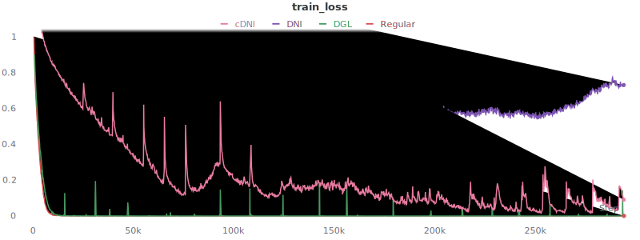

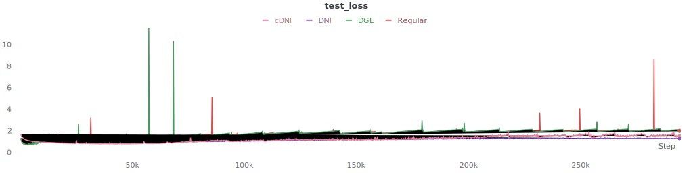

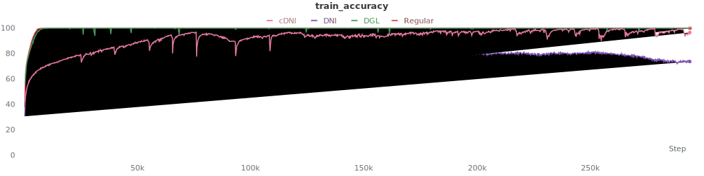

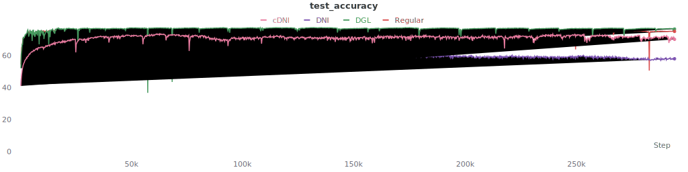

Conclusions:
- Both DGL and the regular model completely overfitted the training-data pretty fast,
  but DNI didn't, and cDNI "almost" did it but not completely. \
  This is probably due to the fact that synthetic gradients don't use the full capacity of the model which causes under-fitting.
- DGL slightly outperformed the regular model with respect to the test accuracy (77.6% v.s. 76.5%). \
  cDNI reached 73.7% (later slightly degraded to 71%-72%). \
  DNI lack behind with 65.6% (later degraded to 58%-60%). \
  My hypothesis is that DGL causes some sort of "regularization" which caused it to outperform
  the regular training, even though they both reached 0 loss.

## 2nd iteration

In the previous iteration, the (best) models reached about 76%-77%, which is below what is normally achieved on the CIFAR-10 dataset. \
In order to increase performance I added data-augmentations:
- Random horizontal flip.
- Random 32x32 crop (after padding with 4 to obtain 40x40 images).
- Data normalization helped a little bit (about 0.5%), 
  but there was no significant difference between normalizing to \[-1,+1\] or to a unit gaussian, 
  so for simplicity \[-1,+1\] was chosen for future experiments.
  
Adding data-augmentations significantly improved performance - from 76%-77% to 85%-86%.
Now there is even less difference between DGL and regular back-prop, and they both reached peak performance of 86.5% test accuracy. \
One notable difference is that DGL's train-loss in decreased slower than regular training, but eventually they both reached (almost) 0 loss.

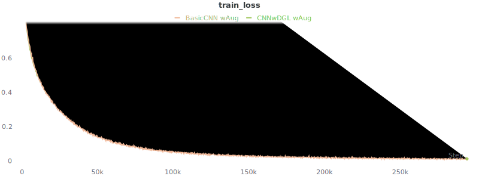

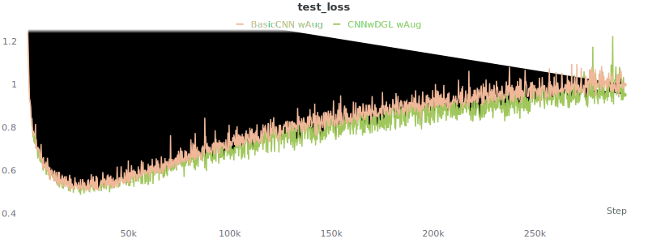

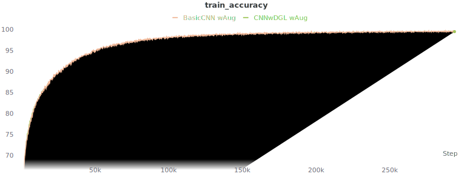

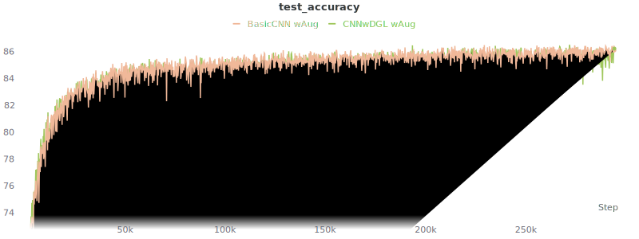

Next, I implemented the VGG models (VGG11/13/16/19), in order to reproduce the performance in the literature which is above 90%. The model I use for the experiment is VGG16 which consists of the following modules: \
(Conv(64)-BatchNorm-ReLU) x 2 \
MaxPool \
(Conv(128)-BatchNorm-ReLU) x 2 \
MaxPool \
(Conv(256)-BatchNorm-ReLU) x 3 \
MaxPool \
(Conv(512)-BatchNorm-ReLU) x 3 \
MaxPool \
(Conv(512)-BatchNorm-ReLU) x 3 \
MaxPool \
Linear(10)
- Note that the VGG model was originally built for ImageNet dataset and not for CIFAR-10. \
  For example, it contains 5 down-sampling layers which cause the last convolutional block to reach spatial size of 1x1 whereas in ImageNet it's 7x7. \
  Additionally, the original VGG model contains additional 2 fully-connected layers with 4096 channels 
  which I omitted (as in the CIFAR-10 implementation of VGG I found online).

Comparing VGG16 to our previous BasicCNN shows increased performance (from 86.5% to 93.2%). DGL now performs worse than regular back-prop, achieving 89.5%.

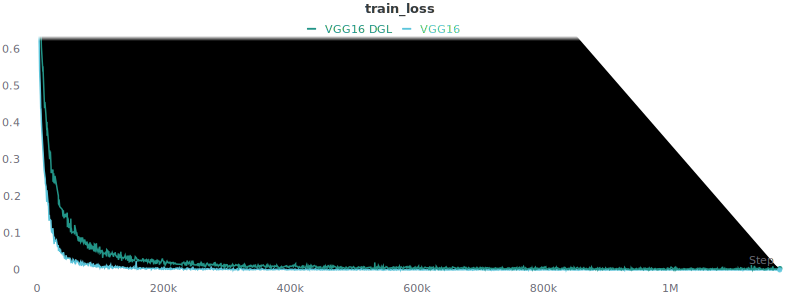

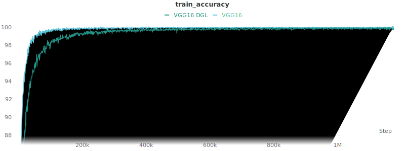

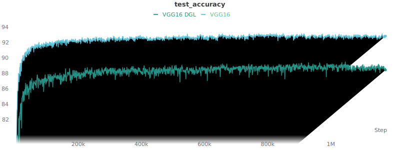

Conclusions:
- DGL extends to other types of architectures like VGG, performing in the same ballpark as regular back-prop but slightly worse.
  -  It is possible that further hyper-parameters search might bridge the gap, as during my (informal) hyper-parameters search I noticed the increasing the learning-rate helped regular back-prop and harmed DGL training.
  - It is possible that different auxiliary networks will increase DGL performance. \
    Currently the auxiliary network used for DGL is one hidden layer MLP with 512 channels. 

# Related Work

## Representation Learning

### [A Simple Framework for Contrastive Learning of Visual Representations] (Feb 2020)

This paper presents SimCLR: A simple framework for contrastive learning of visual representations. \
The self-supervised task is to identify that different augmentations of the same image are the same.

Take home messages:

- Composition of data augmentations is important.
- Adding a nonlinear transformation between the representation and the contrastive loss helps.
- Contrastive learning benefits from larger batch sizes and more training steps compared to supervised learning.

### [Big Self-Supervised Models are Strong Semi-Supervised Learners] (Jun 2020)

This paper presents SimCLRv2: A model based on SimCLR with improvements that reached new state-of-the-art. Generally, the training phase contains three stages: self-supervised pretraining, followed by supervised fine-tuning, and finally distillation with unlabeled examples. Additionally:
- The backbone which learns the representation in a self-supervised way is much larger than original SimCLR - ResNet-152 (3x+SK) v.s. ResNet-50 (4x).
- Later, in the third stage, the model can be made smaller via student-teacher distillation.
- The model uses several "deep-learning tricks" that "make better use of the parameters", such as selective kernels, channel-wise attention mechanism, etc.

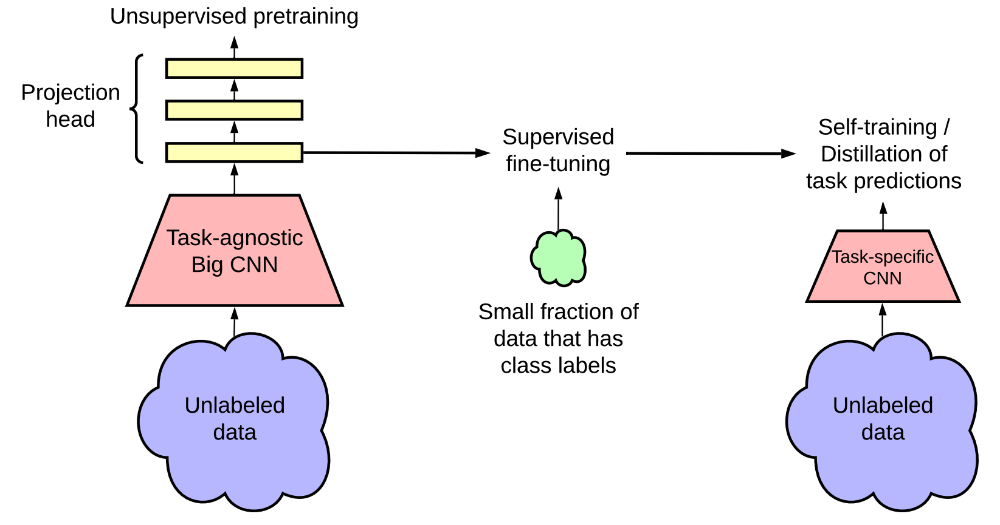

Take home messages:
- Notions of task-agnostic v.s. task-specific use of unlabeled data. 
  The first stage (self-supervised pretraining as in original SimCLR) is task-agnostic, 
  whereas the last stage of distillation via unlabeled examples is task-specific.
- The fewer the labels, the more it is possible to benefit from a bigger model.
  

  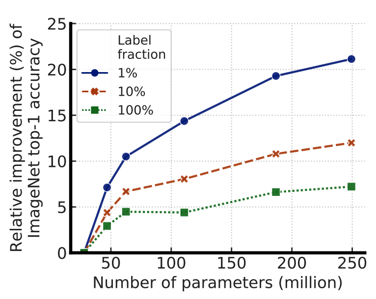
  

- Bigger / deeper projection heads improve representation learning.
  

  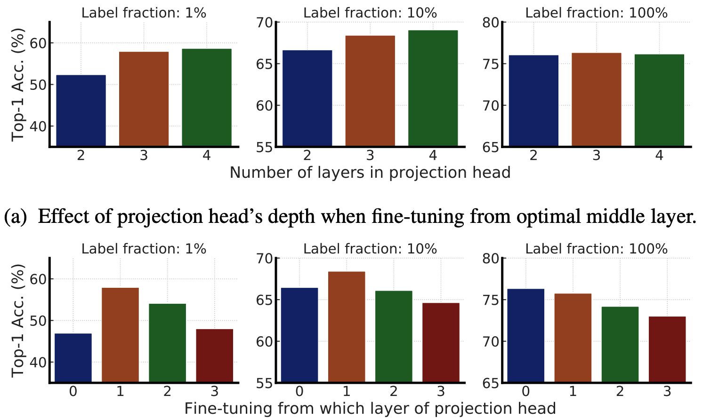
  

### [Representation Learning with Contrastive Predictive Coding] (Jul 2018)

Propose a universal unsupervised learning approach to extract useful representations called Contrastive Predictive Coding. Use a probabilistic contrastive
loss which induces the latent space to capture information that is maximally useful to predict future samples. Demonstrate the approach on speech, images, text and RL.

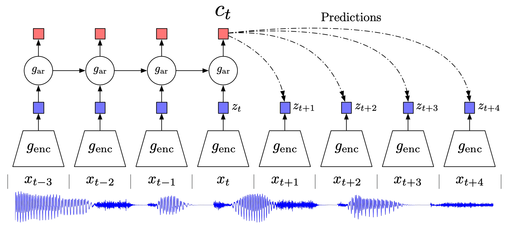

On images (which are not time-series) the model split an image to a grid of overlapping patches, and uses a PixelCNN-style autoregressive model to make predictions about the latent activations in following rows top-to-bottom.

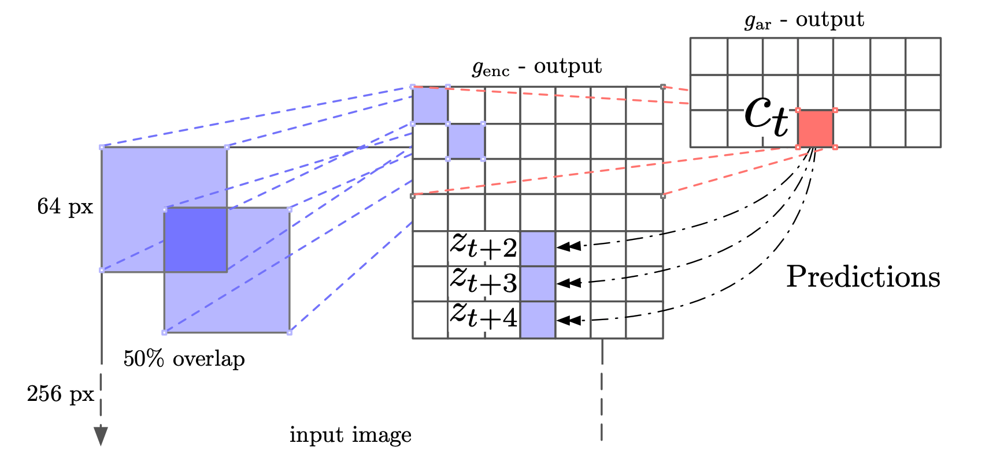

Take home messages:
- They show theoretically that optimizing the InfoNCE loss maximizes a lower bound on the mutual information between the future data-point representation and the context vector (summarizing the past).
- In its time, reached state-of-the-art on unsupervised classification, but this was still quite far from supervised learning.

### [Context Encoders: Feature Learning by Inpainting] (Apr 2016)

Present Context-Encoders - a convolutional neural network trained to generate the contents of an arbitrary image region conditioned on its surroundings. In order to succeed at this task, context encoders need to both understand the content of the entire image. Quantitatively demonstrate the effectiveness of the features for CNN pre-training on classification, detection, and segmentation tasks.

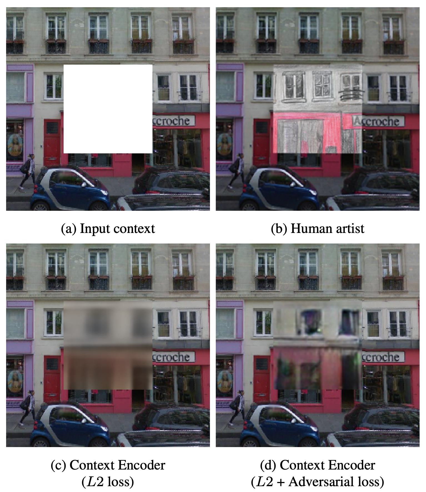

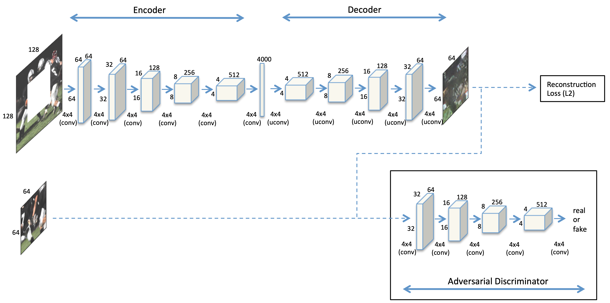

Take home messages:
- Similar in spirit to auto-encoders and denoising auto-encoders. \
  However, in auto-encoders the representation is likely to just compress the image content without learning a semantically meaningful representation. \ 
  Denoising auto-encoders is more similar in spirit, but here a large region is missing and not just localized and low-level corruption, 
  so the high level semantics of the image need to be understood.

### [Predicting What You Already Know Helps: Provable Self-Supervised Learning] (Aug 2020)

Propose a mechanism based on conditional independence to formalize how solving certain pretext tasks can learn 
representations that provably decreases the sample complexity of downstream supervised tasks.

### [Putting An End to End-to-End: Gradient-Isolated Learning of Representations] (May 2019)

Train a neural-network in a self-supervised, local manner (i.e. without labels and without end-to-end backpropagation).

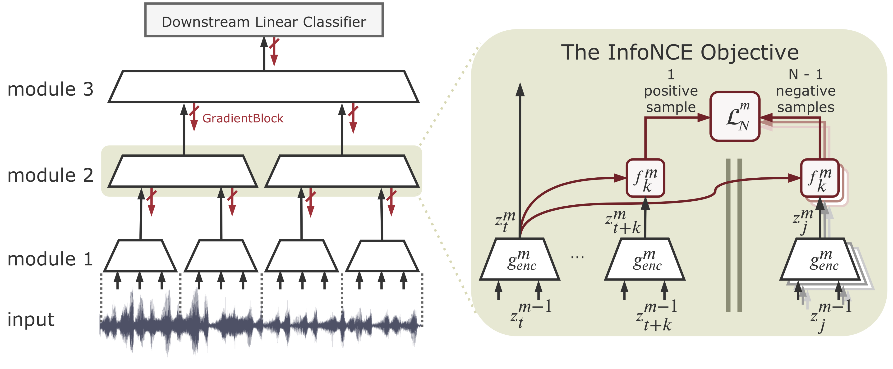

It uses the InfoNCE objective developed in CPC paper ([Representation Learning with Contrastive Predictive Coding]). \
Essentially, this objective pairs the representations of temporally nearby patches and contrasts them against random
pairs. Therefore, as shown in CPC paper, it maximizes the mutual information between temporally nearby representations.

Take home messages:

- Local learning is possible in the regime of self-supervised learning.
- Interesting self-supervised task - maximize the mutual information between temporally nearby representations
  (e.g. different patches of the same image).

### [LoCo: Local Contrastive Representation Learning] (Aug 2020)

Show that by overlapping local blocks stacking on top of each other, we effectively increase the decoder depth and allow
upper blocks to implicitly send feedbacks to lower blocks.

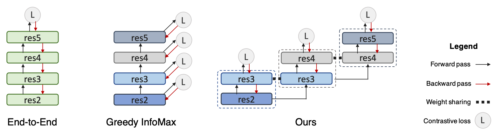

This simple design closes the performance gap between local learning and end-to-end contrastive learning algorithms for
the first time. Aside from standard ImageNet experiments, also show results on complex downstream tasks such as object
detection and instance segmentation.

Take home messages:

- The overlapping enables "communication" between lower and upper layers.
- Self-supervised local learning can reach the performance of supervised back-propagation learning.

## Synthetic Gradients

### [Decoupled Neural Interfaces using Synthetic Gradients] (Aug 2016)

Use auxiliary networks to decouple sub-graphs, enabling updating them independently and asynchronously.

In particular focus on using the modelled synthetic gradient in place of true back-propagated error gradients.

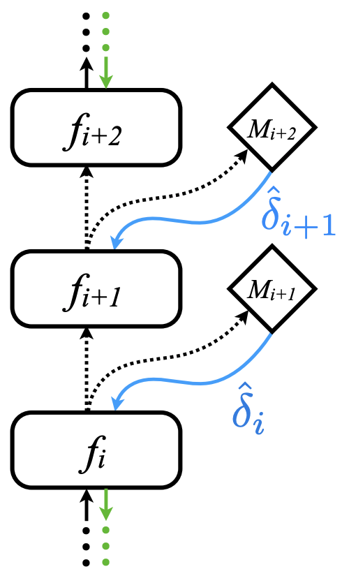

Predicting the inputs to downstream layers is also possible, completely unlocking (i.e. forward-unlocking) the training.

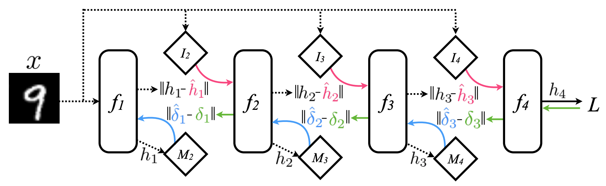

Take home messages:

- Notions of backward-locking, update-locking and forward-locking. \
  All of them are possible (to some extent).
- It works, but (quite) worse than regular back-propagation.

### [Understanding Synthetic Gradients and Decoupled Neural Interfaces] (Mar 2017)

Provide some theoretical explanations to synthetic gradients, for example:

- The critical points of the original optimization problem are maintained when using synthetic-gradients.
- Analyze the learning dynamics of synthetic gradients.

## Layerwise Optimization

### [A Provably Correct Algorithm for Deep Learning that Actually Works] (Mar 2018)

Create a toy dataset containing digits that are generated hierarchically, and prove layerwise optimization works.

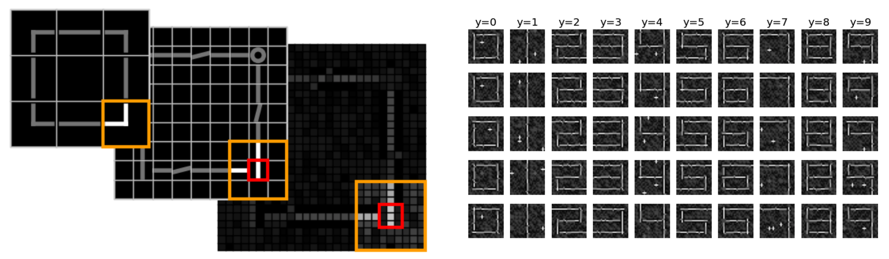

### [Greedy Layerwise Learning Can Scale to ImageNet] (Dec 2018)

Show that greedy layerwise optimization can reach competitive performance on ImageNet.

Take home messages:
- local optimization works.
- layerwise training increases linear separability of the different layers' activations.
- Using auxiliary network with more than 1 hidden layer works better.

### [Decoupled Greedy Learning of CNNs] (Jan 2019)

Show that the greedy layerwise model can be trained in parallel, 
with the possibility of adding a buffer between two adjacent layers to completely unlocking the training process.

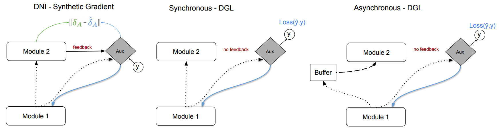

### [Parallel Training of Deep Networks with Local Updates] (Dec 2020)

Provide the first large scale investigation into local update methods in both vision and language domains.

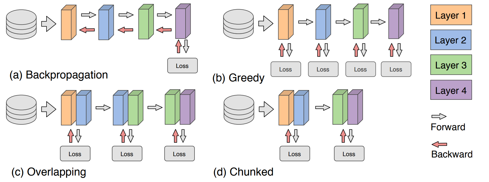

Take home messages:
- Same as LoCo (which was done in the self-supervised setting),
  overlapping of layers seems to help also in the supervised local learning framework.
- Gradients of earlier layers differ from the true gradients (of regular back-prop).
  

  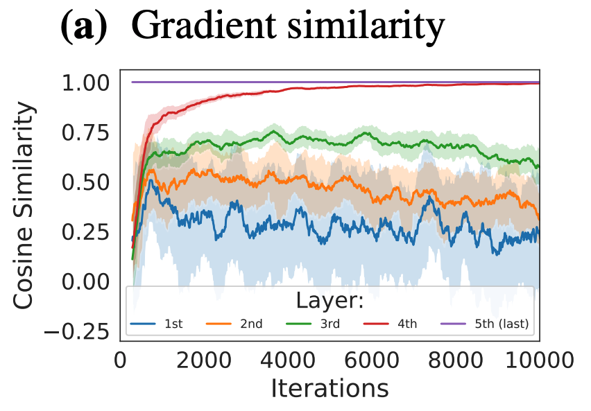
  

- Global back-propagation demonstrates higher capacity, in that it is able to memorize the dataset
  better than local greedy backpropagation.
  

  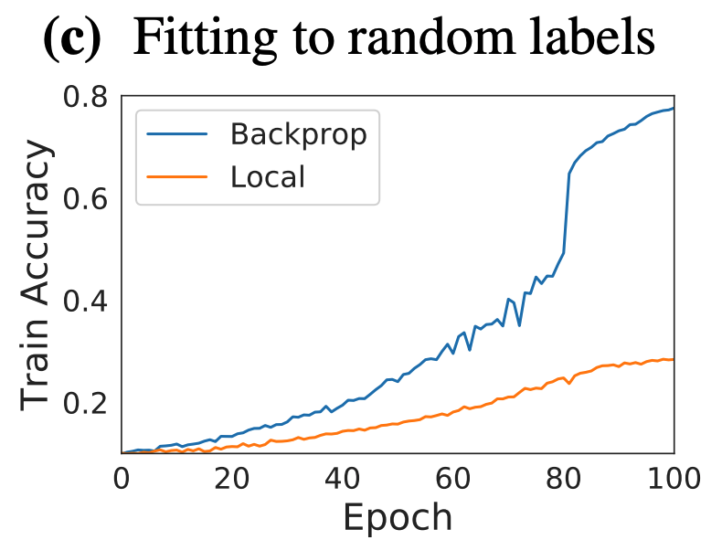
  

- Local methods learn different features (e.g. the first conv filters "look" different).
  

  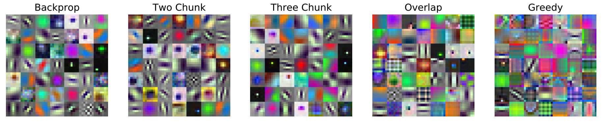
  

## Feedback Alignment

### [Random feedback weights support learning in deep neural networks] (Nov 2014)

Instead of multiplying the back-propagated gradients with the forward weight matrix transposed,
multiply by a random matrix. The motivation is to obtain a more biological plausible learning rule.

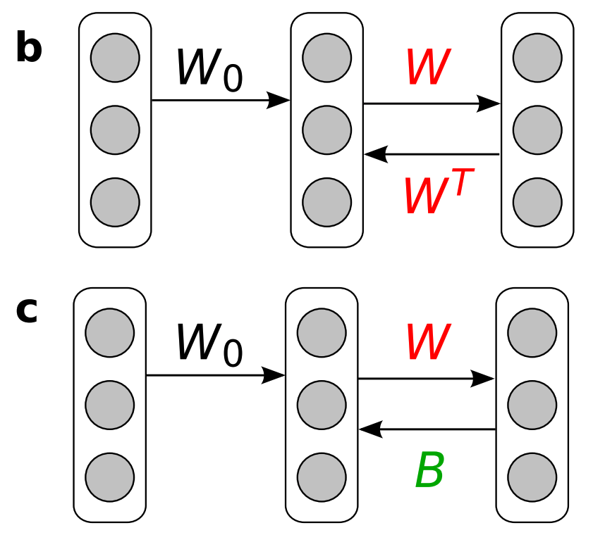

Take home messages:
- The network "learns to learn".
- The angle between the directions of feedback alignment and back-prop decreases to below 90 degrees,
  meaning the direction of progress is still "descending". \
  Interestingly, the angle between the pseudo-inverse of the forward weight matrix goes to zero.
  
  

  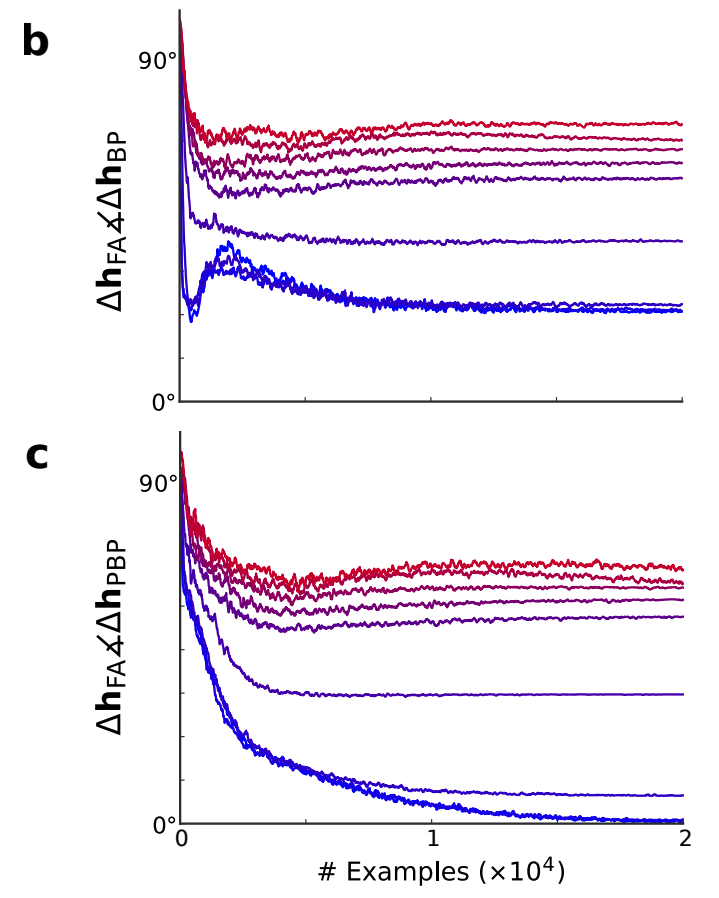
  

  Note that there is also the "Nature communications" version: [Random synaptic feedback weights support error backpropagation for deep learning]

### [Direct Feedback Alignment Provides Learning in Deep Neural Networks] (Sep 2016)

Instead of using a random matrix to multiply with the back-propagated gradient,
use a random matrix for multiplying the top error directly (without backward passing through the top layers).
This enables backward-unlocking of the training process.

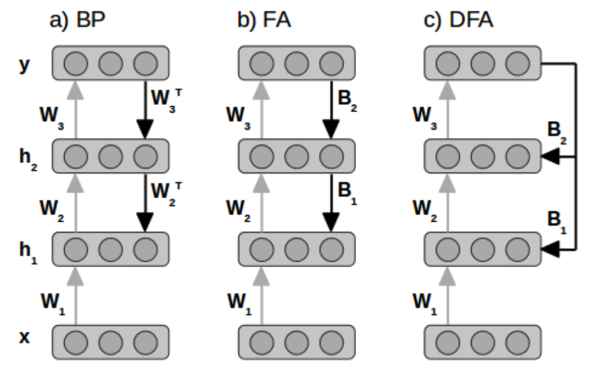

Take home messages:
- Learning is possible even when the feedback path is disconnected from the forward path.
- Performed experiments on small datasets such as MNIST and CIFAR. \
  Works okay, slightly worse performance than back-prop.

### [Direct Feedback Alignment Scales to Modern Deep Learning Tasks and Architectures] (Jun 2020)

Showed empirically that direct feedback alignment works on a variety of different and difficult tasks,
such as neural view synthesis (e.g. NeRF), click-through rate prediction with recommender systems,
geometric learning with graph-convolutional networks and NLP with transformers.

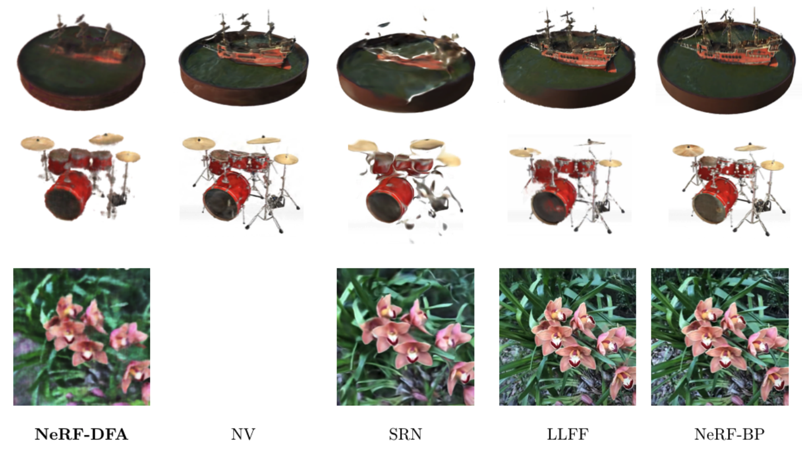

Take home messages:
- Seems to work okay but not as good as back-prop.

## Books

### [Convex Optimization]

### [Online Learning and Online Convex Optimization]

[A Simple Framework for Contrastive Learning of Visual Representations]: https://arxiv.org/pdf/2002.05709.pdf

[Big Self-Supervised Models are Strong Semi-Supervised Learners]: https://arxiv.org/pdf/2006.10029.pdf

[Representation Learning with Contrastive Predictive Coding]: https://arxiv.org/pdf/1807.03748.pdf

[Context Encoders: Feature Learning by Inpainting]: https://arxiv.org/pdf/1604.07379.pdf

[Predicting What You Already Know Helps: Provable Self-Supervised Learning]: https://arxiv.org/pdf/2008.01064.pdf

[Putting An End to End-to-End: Gradient-Isolated Learning of Representations]: https://arxiv.org/pdf/1905.11786.pdf

[LoCo: Local Contrastive Representation Learning]: https://arxiv.org/pdf/2008.01342.pdf

[Decoupled Neural Interfaces using Synthetic Gradients]: https://arxiv.org/pdf/1608.05343.pdf

[Understanding Synthetic Gradients and Decoupled Neural Interfaces]: https://arxiv.org/pdf/1703.00522.pdf

[A Provably Correct Algorithm for Deep Learning that Actually Works]: https://arxiv.org/pdf/1803.09522.pdf

[Greedy Layerwise Learning Can Scale to ImageNet]: https://arxiv.org/pdf/1812.11446.pdf

[Decoupled Greedy Learning of CNNs]: https://arxiv.org/pdf/1901.08164.pdf

[Parallel Training of Deep Networks with Local Updates]: https://arxiv.org/pdf/2012.03837.pdf

[Random feedback weights support learning in deep neural networks]: https://arxiv.org/pdf/1411.0247.pdf

[Random synaptic feedback weights support error backpropagation for deep learning]: https://www.nature.com/articles/ncomms13276.pdf

[Direct Feedback Alignment Provides Learning in Deep Neural Networks]: https://arxiv.org/pdf/1609.01596.pdf

[Direct Feedback Alignment Scales to Modern Deep Learning Tasks and Architectures]: https://arxiv.org/pdf/2006.12878.pdf

[Convex Optimization]: https://web.stanford.edu/~boyd/cvxbook/bv_cvxbook.pdf

[Online Learning and Online Convex Optimization]: https://www.cs.huji.ac.il/~shais/papers/OLsurvey.pdf

[DGL repo]: https://github.com/eugenium/DGL

[DNI repo]: https://github.com/koz4k/dni-pytorch
