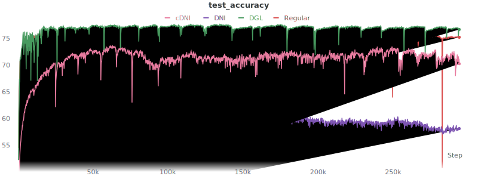
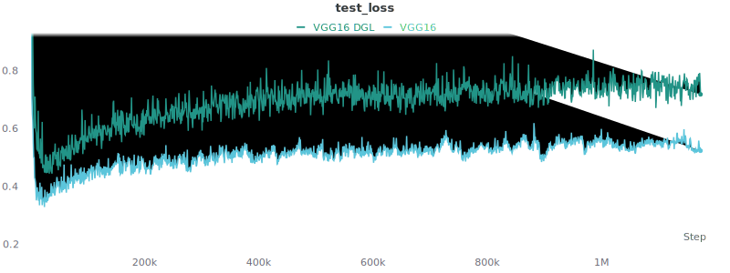
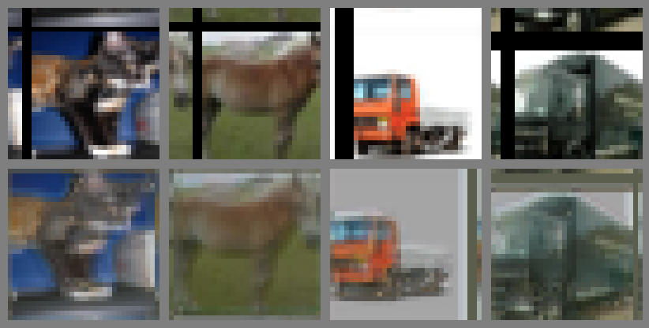
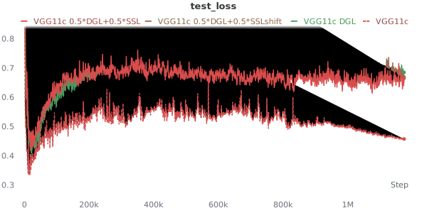
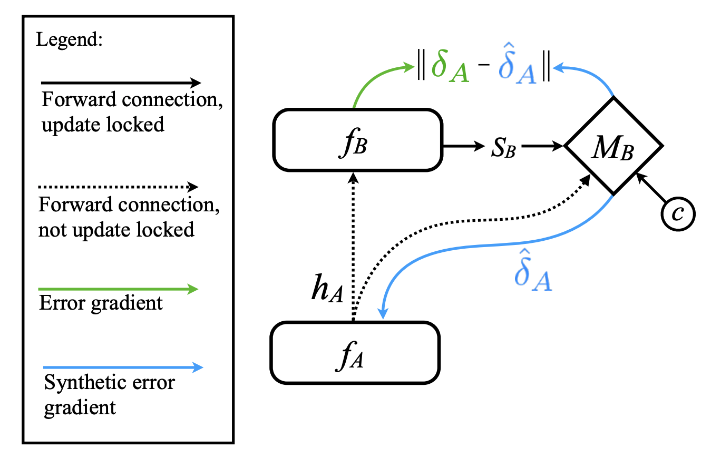
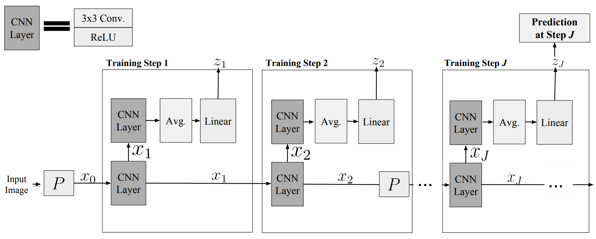
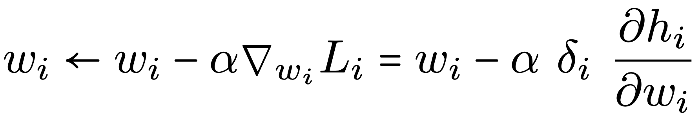

# Table of Contents

- [Table of Contents](#table-of-contents)
- [Introduction](#introduction)
- [Experiments](#experiments)
  - [Getting Started](#getting-started)
    - [Creating The Environment](#creating-the-environment)
      - [CUDA >= 10.2](#cuda--102)
      - [CUDA 9](#cuda-9)
    - [wandb](#wandb)
    - [Clone The Repo](#clone-the-repo)
    - [Running The Experiments](#running-the-experiments)
      - [Prerequisites](#prerequisites)
      - [Example Command-lines](#example-command-lines)
  - [1st iteration](#1st-iteration)
  - [2nd iteration](#2nd-iteration)
  - [3rd iteration](#3rd-iteration)
- [Related Work](#related-work)
  - [Representation Learning](#representation-learning)
    - [SimCLR - A Simple Framework for Contrastive Learning of Visual Representations (Feb 2020)](#simclr---a-simple-framework-for-contrastive-learning-of-visual-representations-feb-2020)
    - [SimCLRv2 - Big Self-Supervised Models are Strong Semi-Supervised Learners (Jun 2020)](#simclrv2---big-self-supervised-models-are-strong-semi-supervised-learners-jun-2020)
    - [CPC - Representation Learning with Contrastive Predictive Coding (Jul 2018)](#cpc---representation-learning-with-contrastive-predictive-coding-jul-2018)
    - [CPCv2 - Data-Efficient Image Recognition with Contrastive Predictive Coding (May 2019)](#cpcv2---data-efficient-image-recognition-with-contrastive-predictive-coding-may-2019)
    - [CMC - Contrastive Multiview Coding (Jun 2019)](#cmc---contrastive-multiview-coding-jun-2019)
    - [Context Encoders: Feature Learning by Inpainting (Apr 2016)](#context-encoders-feature-learning-by-inpainting-apr-2016)
    - [Colorful Image Colorization (Mar 2016)](#colorful-image-colorization-mar-2016)
    - [Predicting What You Already Know Helps: Provable Self-Supervised Learning (Aug 2020)](#predicting-what-you-already-know-helps-provable-self-supervised-learning-aug-2020)
    - [Greedy InfoMax - Putting An End to End-to-End: Gradient-Isolated Learning of Representations (May 2019)](#greedy-infomax---putting-an-end-to-end-to-end-gradient-isolated-learning-of-representations-may-2019)
    - [LoCo: Local Contrastive Representation Learning (Aug 2020)](#loco-local-contrastive-representation-learning-aug-2020)
  - [Synthetic Gradients](#synthetic-gradients)
    - [Decoupled Neural Interfaces using Synthetic Gradients (Aug 2016)](#decoupled-neural-interfaces-using-synthetic-gradients-aug-2016)
    - [Understanding Synthetic Gradients and Decoupled Neural Interfaces (Mar 2017)](#understanding-synthetic-gradients-and-decoupled-neural-interfaces-mar-2017)
  - [Layerwise Optimization](#layerwise-optimization)
    - [A Provably Correct Algorithm for Deep Learning that Actually Works (Mar 2018)](#a-provably-correct-algorithm-for-deep-learning-that-actually-works-mar-2018)
    - [Greedy Layerwise Learning Can Scale to ImageNet (Dec 2018)](#greedy-layerwise-learning-can-scale-to-imagenet-dec-2018)
    - [Decoupled Greedy Learning of CNNs (Jan 2019)](#decoupled-greedy-learning-of-cnns-jan-2019)
    - [Parallel Training of Deep Networks with Local Updates (Dec 2020)](#parallel-training-of-deep-networks-with-local-updates-dec-2020)
    - [Training Neural Networks with Local Error Signals (Jan 2019)](#training-neural-networks-with-local-error-signals-jan-2019)
    - [Revisiting Locally Supervised Learning: an Alternative to End-to-end Training (Sep 2020)](#revisiting-locally-supervised-learning-an-alternative-to-end-to-end-training-sep-2020)
    - [Local Critic Training for Model-Parallel Learning of Deep Neural Networks (Feb 2021)](#local-critic-training-for-model-parallel-learning-of-deep-neural-networks-feb-2021)
  - [Target Propagation](#target-propagation)
    - [Difference Target Propagation (Dec 2014)](#difference-target-propagation-dec-2014)
  - [Feedback Alignment](#feedback-alignment)
    - [Random feedback weights support learning in deep neural networks (Nov 2014)](#random-feedback-weights-support-learning-in-deep-neural-networks-nov-2014)
    - [Direct Feedback Alignment Provides Learning in Deep Neural Networks (Sep 2016)](#direct-feedback-alignment-provides-learning-in-deep-neural-networks-sep-2016)
    - [Direct Feedback Alignment Scales to Modern Deep Learning Tasks and Architectures (Jun 2020)](#direct-feedback-alignment-scales-to-modern-deep-learning-tasks-and-architectures-jun-2020)
  - [Miscellaneous](#miscellaneous)
    - [Training Deep Architectures Without End-to-End Backpropagation: A Brief Survey (Jan 2021)](#training-deep-architectures-without-end-to-end-backpropagation-a-brief-survey-jan-2021)
    - [The Right Tool for the Job: Matching Model and Instance Complexities (Apr 2020)](#the-right-tool-for-the-job-matching-model-and-instance-complexities-apr-2020)
    - [Supervised Contrastive Learning (Apr 2020)](#supervised-contrastive-learning-apr-2020)
    - [A guide to convolution arithmetic for deep learning (Mar 2016)](#a-guide-to-convolution-arithmetic-for-deep-learning-mar-2016)
    - [A guide to receptive field arithmetic for Convolutional Neural Networks (Apr 2017)](#a-guide-to-receptive-field-arithmetic-for-convolutional-neural-networks-apr-2017)
    - [Computing Receptive Fields of Convolutional Neural Networks (Nov 2019)](#computing-receptive-fields-of-convolutional-neural-networks-nov-2019)
    - [Receptive Field Calculator (May 2019)](#receptive-field-calculator-may-2019)
  - [Books](#books)

# Introduction

Trying to figure out a way to optimize neural-networks differently, that will possibly allow parallelization over the
layers
(inherently impossible in back-propagation).

# Experiments

## Getting Started

### Creating The Environment

We use [conda](https://docs.conda.io/en/latest/) and [mamba](https://github.com/mamba-org/mamba) for creating the environments.  
mamba is a used to install packages in conda environment, and it works much faster than conda.

#### CUDA >= 10.2

For training on GPUs having CUDA 10.2, we can use the newest version of PyTorch (currently 1.7.1). 

Create the environment named *torch-cuda10*

```shell
mamba create --name torch-cuda10 python=3.8
```
Install some useful packages for logging and visualizations
```shell
mamba install --name torch-cuda10 loguru wandb -c conda-forge
```
Install PyTorch and torchvision. 
```shell
mamba install --name torch-cuda10 pytorch torchvision cudatoolkit=10.2 -c pytorch
```

#### CUDA 9

For training on GPUs having CUDA 9, we must use PyTorch version <= 1.10.  
Note that using this old version of PyTorch has some pitfalls.  
So far I encountered the absence of Flatten layer and a bug in circular padding.

Create the environment named *torch-cuda9*
```shell
mamba create --name torch-cuda9 python=3.7
```
Install some useful packages for logging and visualizations
```shell
mamba install --name torch-cuda9 loguru wandb -c conda-forge
```
Install PyTorch and torchvision. 
```shell
mamba install --name torch-cuda9 pytorch==1.1.0 torchvision==0.3.0 cudatoolkit=9.0 -c pytorch
```

### wandb

We use [wandb](wandb.ai) for visualizing the experiments. For setting everything up, this section needs to be performed (once, like building the enviroment). 

 
[login](https://app.wandb.ai/login) online to wandb. I used the option of *login with GitHub* and my user is [alonnt](https://wandb.ai/alonnt).

Then, in the environment containing wandb, run `wandb login`.

### Clone The Repo

```shell
git clone git@github.com:AlonNT/Thesis.git <REPO-PATH>
```

### Running The Experiments

#### Prerequisites

SSH to the machine on which you want to run the experiment. Then, cd into the repository directory
```shell
cd <REPO-PATH>
```

Activate the relevant environment you created previously (depending on which GPU you are using), e.g.
```shell
conda activate torch-cuda10
```

The package wandb needs to write some files during running, and by default it writes it to `~/.config/wandb`. While training on a remote machine this path might be in accessible for writing, so we need to change it by running:
```shell
export WANDB_CONFIG_DIR=/PATH/ACCESSIBLE/FROM/REMOTE/MACHINE/.config/wandb/
```

Now run the experiment you want. Each run will log to wandb, as well as to a local log-file (in some predefined directory which defaults to `./experiments`).

#### Example Command-lines

See help for the different possible arguments
```shell
python main.py --help
```

Run an experiment with the default arguments:
```shell
python main.py
```

Run on a GPU, giving a device argument (use different i's for running on different GPUs in the same machine):
```shell
python main.py --device cuda:0
```

Train with DGL:
```shell
python main.py --device cuda:0 --dgl
```

Train with DGL where in each intermediate auxiliary-network use a mixup of 50-50 between the local gradient and the last aux-net gradient:
```shell
python ./main.py --device cuda:0 --dgl --is_direct_global --last_gradient_weight 0.5
```

## 1st iteration

I implemented Decoupled Greedy Learning (took some inspiration from [DGL repo])
I also use [DNI repo] which implemented "Decoupled Neural Interfaces" to incorporate synthetic gradients in my experiments.
I launched training on CIFAR-10 dataset.
The main architecture is (Conv-BatchNorm-ReLU-MaxPool) x 3, followed by a multi-layer-perceptron with 1 hidden layer.
Each conv layer has 128 channels with kernel-size 5 and resolution-preserving padding.
Each affine hidden layer in a multi-layer-perceptron contains 256 channels.
There are 4 variants to the model and training process:
- Regular: The main architecture without changes, as explained previously.
- DGL: Decoupled-Greedy-Learning \
  This model contains an auxiliary network after each block (i.e. Conv-BatchNorm-ReLU-MaxPool).
  Each auxiliary network is a multi-layer-perceptron with 1 hidden layer,
  which predicts the final target (i.e. the classes' scores),
  and it provides the gradient for the relevant block.
  Note that the last "auxiliary network" is actually a part of the final model. \
  The model is implemented in the class `CNNwDGL` in the file `model.py`.
- DNI: Decoupled-Neural-Interface \
  This model contains an auxiliary network after each block (i.e. Conv-BatchNorm-ReLU-MaxPool).
  Each auxiliary network is a CNN containing Conv-BatchNorm-Conv-BatchNorm-Conv
  which preserve the input tensor dimensions (both channels and spatial size).
  The auxiliary network predicts the back-propagated gradient of the downstream layers.
  The model is implemented in the class `CNNwDNI` in the file `model.py`.
- cDNI: Context-Decoupled-Neural-Interface.
  This is the same as DNI except that a "context" (i.e. the label) is provided for each auxiliary network.
  This is done by multiplying the one-hot vector representing the label with a linear layer
  and performs element-wise addition of the result with the output of the first conv layer.

The graphs describing the experiments results are attached.
Ignore the sudden "peaks", it is some sort of numerical issue with my accumulator of the loss and accuracy.

<p align="center">

</p>
<p align="center">

</p>
<p align="center">

</p>
<p align="center">

</p>

Conclusions:
- Both DGL and the regular model completely overfitted the training-data pretty fast,
  but DNI didn't, and cDNI "almost" did it but not completely. \
  This is probably due to the fact that synthetic gradients don't use the full capacity of the model which causes under-fitting.
- DGL slightly outperformed the regular model with respect to the test accuracy (77.6% v.s. 76.5%). \
  cDNI reached 73.7% (later slightly degraded to 71%-72%). \
  DNI lack behind with 65.6% (later degraded to 58%-60%). \
  My hypothesis is that DGL causes some sort of "regularization" which caused it to outperform
  the regular training, even though they both reached 0 loss.

## 2nd iteration

In the previous iteration, the (best) models reached about 76%-77%, which is below what is normally achieved on the CIFAR-10 dataset. \
In order to increase performance I added data-augmentations:
- Random horizontal flip.
- Random 32x32 crop (after padding with 4 to obtain 40x40 images).
- Data normalization helped a little bit (about 0.5%), 
  but there was no significant difference between normalizing to \[-1,+1\] or to a unit gaussian, 
  so for simplicity \[-1,+1\] was chosen for future experiments.
  
Adding data-augmentations significantly improved performance - from 76%-77% to 85%-86%.
Now there is even less difference between DGL and regular back-prop, and they both reached peak performance of 86.5% test accuracy. \
One notable difference is that DGL's train-loss in decreased slower than regular training, but eventually they both reached (almost) 0 loss.

<p align="center">

</p>
<p align="center">

</p>
<p align="center">

</p>
<p align="center">

</p>

Next, I implemented the VGG models (VGG11/13/16/19), in order to reproduce the performance in the literature which is above 90%. The model I use for the experiment is VGG16 which consists of the following modules: \
(Conv(64)-BatchNorm-ReLU) x 2 \
MaxPool \
(Conv(128)-BatchNorm-ReLU) x 2 \־
MaxPool \
(Conv(256)-BatchNorm-ReLU) x 3 \
MaxPool \
(Conv(512)-BatchNorm-ReLU) x 3 \
MaxPool \
(Conv(512)-BatchNorm-ReLU) x 3 \
MaxPool \
Linear(10)
- Note that the VGG model was originally built for ImageNet dataset and not for CIFAR-10. \
  For example, it contains 5 down-sampling layers which cause the last convolutional block to reach spatial size of 1x1 whereas in ImageNet it's 7x7. \
  Additionally, the original VGG model contains additional 2 fully-connected layers with 4096 channels 
  which I omitted (as in the CIFAR-10 implementation of VGG I found online).

Comparing VGG16 to our previous BasicCNN shows increased performance (from 86.5% to 93.2%). DGL now performs worse than regular back-prop, achieving 89.5%.

<p align="center">

</p>
<p align="center">

</p>
<p align="center">

</p>
<p align="center">

</p>

Conclusions:
- DGL extends to other types of architectures like VGG, performing in the same ballpark as regular back-prop but slightly worse.
  -  It is possible that further hyper-parameters search might bridge the gap, as during my (informal) hyper-parameters search I noticed the increasing the learning-rate helped regular back-prop and harmed DGL training.
  - It is possible that different auxiliary networks will increase DGL performance. \
    Currently the auxiliary network used for DGL is one hidden layer MLP with 512 channels. 

## 3rd iteration

After our meeting in 14.01.2021 we thought about new directions for experiments. Basically, play with the local objectives in the training process, trying to bridge the gap between DGL and BP.  
The intuitive idea was to incorporate self-supervised tasks in the layers' objectives, in an ascending complexity. The concrete idea was to try and predict the shifted image, meaning performing pixel-labeling where each pixel is trying to guess what the value of a pixel nearby, slightly exceeding its receptive field.  

About a week later, inspiration was taken from [Nøkland & Eidnes, 2019](#training-neural-networks-with-local-error-signals-jan-2019), where each layer's objective is mixed between predictive loss (same as DGL) and supervised-contrastive-loss. So we thought to mix the precition loss with some other form of loss, in a similar fashion.

As a "gentle start", I started with predicting the original input images (without any shift). Basically it's like each layer's output is the representation of an auto-encoder. The predictions are successful - in the following figure the prediction (bottom row) are shown in additions to the labels (top row) of first/middle/last layer. The differences between the predictions and the labels are almost not visible, they become a bit blurry with increasing depth (take a look at the cat's fact in the last layer).

<p align="center">


</p>

Then, I tried to use a shifted image as a target in an "ascending complexity" so each layer's target image is more shifted. Practically, I used linear ascending shifts from 5 to 16 (half of the total image size). Note that I used circular padding here (instead of zero-padding), it seemed more reasonable. The predictions here are "less successful" but its quite different across layers:

<p align="center">



</p>

Technical experimental details:

- I used a basic sequential architecture and named it *VGG11c*.  
  It contains the same layers as the original VGG11 which was built for ImageNet,
  but I reduced the number of pooling layers from 5 to 3 
  (to get 4x4 instead of 1x1 in the last conv output).  
  [Here](https://wandb.ai/alonnt/thesis/runs/qcsmy2w3) you can find graphs, model's textual description and hyper-parameters. 
  The original (back-prop) version reached **93.89%** test accuracy.
- I experimented with several aspects:
  - Different architectures (shallow v.s. deep, wide v.s. narrow).
  - Weights of the DGL v.s. SSL losses.
  - Hyper-parameters (learning-rate, batch-size, weight-decay, dropout, etc).
  
  However, the conclusions I put here were seen all over the place.
- For the SSL-aux-net predictions, their labels were first down-sampled 
  (to the same spatial size of the block's output tensor). However, soon it looks pretty bad (4x4 or 8x8 images from 32x32) so and up-sampling layers were added in the form of transposed convolutions.   
  It would be interesting to try and use simple bilinear interpolation as up-sampling, instead of learned one.
- For predicting the shifted image, at first I tried to calculate the receptive field of each layer, 
  in order to ask each pixel to predict the pixel just after its receptive field.  
  - I followed this [guide](#a-guide-to-convolution-arithmetic-for-deep-learning-mar-2016) and this [guide](#computing-receptive-fields-of-convolutional-neural-networks-nov-2019) as well, both are pretty good (but a bit overwhelming and too heavy for a simple feed-forward network).  
    Evetually found [receptive field calculator](#receptive-field-calculator-may-2019) which enable calculating on a simple feed-forward networks.
  - After calculating the receptive field, since CIFAR-10 images are quite small (32x32) 
    it quickly grows to be the whole image.  
    Anyway, I thought that calculating the exact receptive field is not important as pixels next to each other are similar, and the general idea was to make auxiliary tasks ascend in their complexity, which happens anyway.  
    This led to using linear ascending shifts from 5 to 16 (half of the total image size).
- At first, the pred-aux-net and ssl-aux-net both got the block's output tensor which 
  was possibly after pooling operation. After further thought, it seems more reasonable for pred-aux-net to get the tensor after pool (to decrease dimensionality and therefore parameters count), and ssl-aux-net before pool (to perform less up-sampling to the 32x32).

Experiment results:

- Here are the graphs of the regular model v.s. DGL 
  v.s. DGL+SSL (original/shifted) each weighted 0.5.
  <p align="center">
  
  
  </p>
  It seems that predicting original images (solid red) did not change much DGL (green),
  whereas predicting the shifted image (brown) causes a degradation.

In order to check if the SSL loss is worthless I performed the following experiment:

1. I disabled the DGL loss so every layer in the network does not get a signal
   from the supervised loss - only from the SSL loss.
2. For references - as an "upper bound" I used the regular back-prop training and the DGL one,
   and as a "lower bound" I trained a model with fixed random layers except from the last block
   and its auxiliary network.
3. Here are the results:
   <p align="center">
   
   
   </p>
   It seems that treating each layer as an auto-encoder indeed learns meaningful features for upstream layers.
   Learning the shifted images also beats random initialization, but performs slightly worse than the former.
4. Note that in this setting a larger learning-rate was useful (0.015 v.s. 0.003), 
   even though all other hyper-parameters were the same as BP.

Food for thoughts:

- Predicting the original input images certainly extracted better-than-random features.  
  However, as pointed out by [Wang et al.], intuitively neural-networks should preserve
  information regarding the input, but **discard task irrelevant information**.  
  Using reconstruction loss alone only preserves information regarding the input,
  it does not relate to the task in hand.
  - Can we incorporate some sort of task-irrelevant information disposal?  
    Does it have to take the labels into account?
  - Other self-supervised methods (e.g. SimCLR) also does not involve the task in their features extraction, 
    how does it match the observations in [Wang et al.]?  
    Possible answer - self-supervised tasks indeed relate to the final task in hand, even though they are not the same task. 
    Task relevant information for them is also relevant for the final task, etc.

- Further techinal work on the models might give different insights.  
  For example:
  - Currently the pred-aux-net is 1 hidden layer MLP.  
    As shown in several previous works it's better to use an auxiliary network containing a conv layer as well.
  - Use a simple upsampling function instead of a learned one (with transposed convolutions).  
    Maybe it'll help with the poor results for shifted image predictions.

Meeting Conclusions (11/02/2021):

- As another "lower-bound" reference for SSL-alone we can use a model which consists only the last block
  (without random scrambling the image with several randomly initialized layers).
- Reaching good performance only with SSL is cool. We're not there yet but maybe we can improve it.
- Find other tasks - similar to SimCLR or other tasks. Maybe use rotations somehow?
- In earlier layers make easier tasks. For example, separate between only 2 classes instead of 10.
- Techinal improvements:
  - Maybe the data augmentation that is currently being used (4x4 zero-padding followed by randon 32x32 crop) 
    is not suitable for predicting the nearby pixel, because how could we know if it's black or not.
    Try to use random crop followed by scaling back to 32x32, to avoid these black regions.
  - Split to blocks and not make the training process totally local (same as [Wang et al.]).
- All of the above is local, meaning that earilier layers do not "prepare" their output to suit the next layers.  
  How to incorporate the final network's prediction to the learning process?  
  For example, direct feedback alignment does it.  
  We want the layer's objective to not be totally-greedy, but also improve the performance of the whole network.
  Maybe combine it with.
- How can we use "Gradient descent without a dradient".  
  Note that high dimensionality is a problem here. 
  We are in a highly high dimensional space and we choose some direction in random. 
  The chances that this direction will worth something is negligble. 
  Maybe we can somehow sample a better in this huge space. Suppose that the input is in some linear sub-space. 

# Related Work

## Representation Learning

### SimCLR - A Simple Framework for Contrastive Learning of Visual Representations (Feb 2020)

- Ting Chen, Simon Kornblith, Mohammad Norouzi, Geoffrey Hinton.  
  Google Research, Brain Team.
- Accepted to ICML 2020.
- [paper](https://arxiv.org/pdf/2002.05709.pdf)
- [code](https://github.com/google-research/simclr)

This paper presents SimCLR: A simple framework for contrastive learning of visual representations. \
The self-supervised task is to identify that different augmentations of the same image are the same.

<p align="center">

</p>

Take home messages:

- Composition of data augmentations is important.
- Adding a nonlinear transformation between the representation and the contrastive loss helps.
- Contrastive learning benefits from larger batch sizes and more training steps compared to supervised learning.

### SimCLRv2 - Big Self-Supervised Models are Strong Semi-Supervised Learners (Jun 2020)

- Ting Chen, Simon Kornblith, Kevin Swersky, Mohammad Norouzi, Geoffrey Hinton.  
  Google Research, Brain Team.
- Accepted to NeurIPS 2020.
- [paper](https://arxiv.org/pdf/2006.10029.pdf)
- [code](https://github.com/google-research/simclr)

This paper presents SimCLRv2: A model based on SimCLR with improvements that reached new state-of-the-art. Generally, the training phase contains three stages: self-supervised pretraining, followed by supervised fine-tuning, and finally distillation with unlabeled examples. Additionally:
- The backbone which learns the representation in a self-supervised way is much larger than original SimCLR - ResNet-152 (3x+SK) v.s. ResNet-50 (4x).
- Later, in the third stage, the model can be made smaller via student-teacher distillation.
- The model uses several "deep-learning tricks" that "make better use of the parameters", such as selective kernels, channel-wise attention mechanism, etc.

<p align="center">

</p>

Take home messages:
- Notions of task-agnostic v.s. task-specific use of unlabeled data. 
  The first stage (self-supervised pretraining as in original SimCLR) is task-agnostic, 
  whereas the last stage of distillation via unlabeled examples is task-specific.
- The fewer the labels, the more it is possible to benefit from a bigger model.
  <p align="center">
  
  </p>
- Bigger / deeper projection heads improve representation learning.
  <p align="center">
  
  </p>

### CPC - Representation Learning with Contrastive Predictive Coding (Jul 2018)

- Aaron van den Oord, Yazhe Li, Oriol Vinyals.  
  DeepMind, London, UK.
- [paper](https://arxiv.org/pdf/1807.03748.pdf)

Propose a universal unsupervised learning approach to extract useful representations called Contrastive Predictive Coding. Use a probabilistic contrastive
loss which induces the latent space to capture information that is maximally useful to predict future samples. Demonstrate the approach on speech, images, text and RL.

<p align="center">

</p>

On images (which are not time-series) the model split an image to a grid of overlapping patches, and uses a PixelCNN-style autoregressive model to make predictions about the latent activations in following rows top-to-bottom.

<p align="center">

</p>

Take home messages:
- They show theoretically that optimizing the InfoNCE loss maximizes a lower bound on the mutual information between the future data-point representation and the context vector (summarizing the past).
- In its time, reached state-of-the-art on unsupervised classification, but this was still quite far from supervised learning.

### CPCv2 - Data-Efficient Image Recognition with Contrastive Predictive Coding (May 2019)

- Olivier J. Henaff. Aravind Srinivas, Jeffrey De Fauw, Ali Razavi, Carl Doersch, S. M. Ali Eslami, Aaron van den Oord.  
  DeepMind, London, UK.  
  University of California, Berkeley.
- [paper](https://arxiv.org/pdf/1905.09272.pdf)

A self-supervised learning approach that builds upon the original CPC with several improvements - model capacity, layer normalization, predicting with context from all directions rather than just from above, path-based augmentations.

<p align="center">

</p>

They assess CPCv2 in several contexts:
- Linear classification on top of the learned representations.  
  They suprass all self-supervised techniques at that time.
- Transfer learning to object detection in PASCAL dataset.   
  They reach a new state-of-the-art, surpassing supervised transfer-learning.
- Data-efficient learning - learning with less labeled data.  
  They surpass supervised learning with x5-x2 less labeled data, as seen in the graph.  
  <p align="center">
  
  </p>

Take-home messages:
- Self-supervised representations seem to be more "data-efficient", as seen both here and in SimCLRv2.

### CMC - Contrastive Multiview Coding (Jun 2019)

- Yonglong Tian, Dilip Krishnan, Phillip Isola.  
  MIT CSAIL.  
  Google Research.
- [paper](https://arxiv.org/pdf/1906.05849.pdf)
- [code](https://github.com/HobbitLong/CMC/)

Learn a representation in a similar manner as CPC, but instead of maximize mutual information between different patches in an image, it maximizes mutual information between different views of the same image. Note that it scales to any number of views.  

<p align="center">

</p>

Show empirical results on:
- ImageNet classification when the different views are luminance and chrominance in color images. 
- Video - views are images v.s. optival flow.
- Luminance, chrominance, depth, surface normal and semantic labels on NYU-Depth dataset.

Take-home messages:
- As shown in their experiments, it seems that contrastive loss outperform predictive loss. 
  E.g., it's better to predict that a pair of views is similar rather than predicting one view from the other.
  <p align="center">
  
  </p>

### Context Encoders: Feature Learning by Inpainting (Apr 2016)

- Deepak Pathak, Philipp Krahenbuhl, Jeff Donahue, Trevor Darrell, Alexei A. Efros.  
  University of California, Berkeley.
- Accepted to CVPR 2016.
- [paper](https://arxiv.org/pdf/1604.07379.pdf)
- [code](https://github.com/pathak22/context-encoder)

Present Context-Encoders - a convolutional neural network trained to generate the contents of an arbitrary image region conditioned on its surroundings. In order to succeed at this task, context encoders need to both understand the content of the entire image. Quantitatively demonstrate the effectiveness of the features for CNN pre-training on classification, detection, and segmentation tasks.

<p align="center">

</p>

<p align="center">

</p>

Take home messages:
- Similar in spirit to auto-encoders and denoising auto-encoders. \
  However, in auto-encoders the representation is likely to just compress the image content without learning a semantically meaningful representation. \ 
  Denoising auto-encoders is more similar in spirit, but here a large region is missing and not just localized and low-level corruption, 
  so the high level semantics of the image need to be understood.

### Colorful Image Colorization (Mar 2016)

- Richard Zhang, Phillip Isola, Alexei A. Efros.  
  University of California, Berkeley.
- Accepted to ECCV 2016.
- [paper](https://arxiv.org/pdf/1603.08511.pdf)
- [code](https://github.com/richzhang/colorization)

Given a grayscale image predict a plausible color version of the image. \
This colorization can be a powerful pretext task for self-supervised feature learning, acting as a *cross-channel encoder*. Results in state-of-the-art performance on several feature learning benchmarks.

<p align="center">

</p>

<p align="center">

</p>

Take home messages:
- Interesting auxiliary task because colorization requires understanding of the semantics of the image.

### Predicting What You Already Know Helps: Provable Self-Supervised Learning (Aug 2020)

- Jason D. Lee, Qi Lei, Nikunj Saunshi, Jiacheng Zhuo.  
  Princeton University.  
  University of Texas at Austin.
- [paper](https://arxiv.org/pdf/2008.01064.pdf)

Propose a mechanism based on conditional independence to formalize how solving certain pretext tasks can learn 
representations that provably decreases the sample complexity of downstream supervised tasks.

### Greedy InfoMax - Putting An End to End-to-End: Gradient-Isolated Learning of Representations (May 2019)

- Sindy Löwe, Peter O`Connor, Bastiaan S. Veeling.  
  AMLab; University of Amsterdam.
- Accepted to NeurIPS 2019 (Honorable Mention Outstanding New Directions Paper Award).
- [paper](https://arxiv.org/pdf/1905.11786.pdf)
- [code](https://github.com/loeweX/Greedy_InfoMax)

Train a neural-network in a self-supervised, local manner (i.e. without labels and without end-to-end backpropagation).

<p align="center">

</p>

It uses the InfoNCE objective developed in CPC paper ([Representation Learning with Contrastive Predictive Coding]). \
Essentially, this objective pairs the representations of temporally nearby patches and contrasts them against random
pairs. Therefore, as shown in CPC paper, it maximizes the mutual information between temporally nearby representations.

Take home messages:

- Local learning is possible in the regime of self-supervised learning.
- Interesting self-supervised task - maximize the mutual information between temporally nearby representations
  (e.g. different patches of the same image).

### LoCo: Local Contrastive Representation Learning (Aug 2020)

- Yuwen Xiong, Mengye Ren, Raquel Urtasun.  
  Uber ATG.  
  University of Toronto.
- Accepted to NeurIPS 2020.
- [paper](https://arxiv.org/pdf/2008.01342.pdf)

Show that by overlapping local blocks stacking on top of each other, we effectively increase the decoder depth and allow
upper blocks to implicitly send feedbacks to lower blocks.

<p align="center">

</p>

This simple design closes the performance gap between local learning and end-to-end contrastive learning algorithms for
the first time. Aside from standard ImageNet experiments, also show results on complex downstream tasks such as object
detection and instance segmentation.

Take home messages:

- The overlapping enables "communication" between lower and upper layers.
- Self-supervised local learning can reach the performance of supervised back-propagation learning.

## Synthetic Gradients

### Decoupled Neural Interfaces using Synthetic Gradients (Aug 2016)

- Max Jaderberg, Wojciech Marian Czarnecki, Simon Osindero, Oriol Vinyals, Alex Graves, David Silver, Koray Kavukcuoglu.  
  DeepMind, London, UK.
- Accepted to ICML 2017.
- [paper](https://arxiv.org/pdf/1608.05343.pdf)
- [code](https://github.com/koz4k/dni-pytorch)

Use auxiliary networks to decouple sub-graphs, enabling updating them independently and asynchronously.

<p align="center">

</p>

In particular focus on using the modelled synthetic gradient in place of true back-propagated error gradients.

<p align="center">

</p>

Predicting the inputs to downstream layers is also possible, completely unlocking (i.e. forward-unlocking) the training.

<p align="center">

</p>

Take home messages:

- Notions of backward-locking, update-locking and forward-locking. \
  All of them are possible (to some extent).
- It works, but (quite) worse than regular back-propagation.

### Understanding Synthetic Gradients and Decoupled Neural Interfaces (Mar 2017)

- Wojciech Marian Czarnecki, Grzegorz Swirszcz, Max Jaderberg, Simon Osindero, Oriol Vinyals,
Koray Kavukcuoglu.  
  DeepMind, London, UK.
- Accepted to ICML 2017.
- [paper](https://arxiv.org/pdf/1703.00522.pdf)

Provide some theoretical explanations to synthetic gradients, for example:

- The critical points of the original optimization problem are maintained when using synthetic-gradients.
- Analyze the learning dynamics of synthetic gradients.

## Layerwise Optimization

### A Provably Correct Algorithm for Deep Learning that Actually Works (Mar 2018)

- Eran Malach, Shai Shalev-Shwartz.  
  The Hebrew University, Israel.
- [paper](https://arxiv.org/pdf/1803.09522.pdf)

Create a toy dataset containing digits that are generated hierarchically, and prove layerwise optimization works.

<p align="center">

</p>

### Greedy Layerwise Learning Can Scale to ImageNet (Dec 2018)

- Eugene Belilovsky, Michael Eickenberg, Edouard Oyallon.  
  Mila, University of Montreal.  
  University of California, Berkeley.  
  CentraleSupelec, University of Paris-Saclay.
- Accepted to ICML 2019.
- [paper](https://arxiv.org/pdf/1812.11446.pdf)

Show that greedy layerwise optimization can reach competitive performance on ImageNet.

<p align="center">

</p>

Take home messages:
- local optimization works.
- layerwise training increases linear separability of the different layers' activations.
- Using auxiliary network with more than 1 hidden layer works better.

### Decoupled Greedy Learning of CNNs (Jan 2019)

- Eugene Belilovsky, Michael Eickenberg, Edouard Oyallon.  
  Mila, University of Montreal.  
  University of California, Berkeley.  
  CentraleSupelec, University of Paris-Saclay.
- Accepted to ICML 2020.
- [paper](https://arxiv.org/pdf/1901.08164.pdf)
- [code](https://github.com/eugenium/DGL)

Show that the greedy layerwise model can be trained in parallel, 
with the possibility of adding a buffer between two adjacent layers to completely unlocking the training process.

<p align="center">

</p>

### Parallel Training of Deep Networks with Local Updates (Dec 2020)

- Michael Laskin, Luke Metz, Seth Nabarro, Mark Saroufim, Badreddine Noune, Carlo Luschi, Jascha Sohl-Dickstein, Pieter Abbeel.  
  University of Berkeley.  
  Google Research, Brain Team.  
  Graphcore.
- [paper](https://arxiv.org/pdf/2012.03837.pdf)

Provide the first large scale investigation into local update methods in both vision and language domains.

<p align="center">

</p>

Take home messages:
- Same as LoCo (which was done in the self-supervised setting),
  overlapping of layers seems to help also in the supervised local learning framework.
- Gradients of earlier layers differ from the true gradients (of regular back-prop).
  <p align="center">
  
  </p>
- Global back-propagation demonstrates higher capacity, in that it is able to memorize the dataset
  better than local greedy backpropagation.
  <p align="center">
  
  </p>
- Local methods learn different features (e.g. the first conv filters "look" different).
  <p align="center">
  
  </p>

### Training Neural Networks with Local Error Signals (Jan 2019)

- Arild Nøkland, Lars H. Eidnes.  
  Kongsberg Seatex, Trondheim, Norway.
- Accepted to ICML 2019.
- [paper](https://arxiv.org/pdf/1901.06656.pdf)
- [code](https://github.com/anokland/local-loss)

Use single-layer auxiliary-networks and two different supervised loss functions to generate local error signals, 
and show that the combination of these losses helps.

<p align="center">

</p>

In addition to predicting the target classes' scores, they add another a 'similiarity loss' which encourages distinct classes to have distinct representations.
They perform experiments using VGG-like networks on a lot of datasets, approaching and sometime surpassing the performance of regular back-prop. For example, in CIFAR-10 reached 95%-96% test accuracy.

Take home messages:
- Similiary loss works quite good, and somehow complementary to regular prediction loss (indeed, using combination of these losses helps).

### Revisiting Locally Supervised Learning: an Alternative to End-to-end Training (Sep 2020)

- Yulin Wang, Zanlin Ni, Shiji Song, Le Yang & Gao Huang.  
  Department of Automation, BNRist, Tsinghua University, Beijing, China.
- Accepted to ICLR 2021.
- [paper](https://arxiv.org/pdf/2101.10832.pdf)
- [code](https://github.com/blackfeather-wang/InfoPro-Pytorch)

Experimentally show that simply training local modules with E2E loss tends to collapse task-relevant information at early layers, and hence hurts the performance of the full model.  
To avoid this issue, propose an information propagation (InfoPro) loss, which encourages local modules to preserve as much useful information as possible, while progressively discard task-irrelevant information. The proposed method boils down to minimizing the combination of a reconstruction loss and a normal cross-entropy/contrastive term.

The intuitive idea is presented in the following figure:
<p align="center">

</p>
and these graphs show that greedy SL contributes to dramatically more discriminative features with the first few local modules, whereas E2E learned network progressively boosts the linear separability of features throughout the whole network with even more significant effects in the later layers, surpassing greedy SL eventually.  
<p align="center">

</p>
This raises an interesting question: *why does the full network achieve inferior performance in greedy SL compared to the E2E counterpart, even though the former is based on more discriminative earlier features*?  

The conjecture is that the answer to the above question might lie in the differences of features
apart from merely separability - in E2E learned networks, I(h, y) remains unchanged when the features pass through all the layers, while I(h, x) reduces gradually, revealing that the models progressively discard task-irrelevant information. However, greedily trained networks collapse both I(h, x) and I(h, y) in their first few modules. 

The InfoPro loss is defined as:
<p align="center">

</p>
where r* capture as much task-irrelevant information in h as possible.   
Upper for the intractable InfoPro loss is:
<p align="center">

</p>
estimating I(h,x) by training a decoder to obtain the minimal reconstruction loss, and estimating I(h,y) by a regular classification fashion (with the cross-entropy loss) or by using contrastive representation loss (making representations of same-class similar and different-class different).

### Local Critic Training for Model-Parallel Learning of Deep Neural Networks (Feb 2021)

- Hojung Lee, Cho-Jui Hsieh, Jong-Seok Lee.  
  Yonsei University, Incheon, Korea.  
  University of California at Los Angeles (UCLA), CA, USA.
- [paper](https://arxiv.org/pdf/2102.01963.pdf)
- [code](https://github.com/hjdw2/Local-critic-training)

Very similar concept to DGL, except that the auxiliary networks are trained by minimizing the differences of adjacent losses (instead of the gradients of the losses temselves). 

The main network is divided into several modules f_i by the local critic networks c_i and each local critic network delivers an estimated error gradient to the module. 
<p align="center">

</p>
The error gradient for training f_i is obtained by differentiating L_i = l(Z_i,y) with respect to h_i, obtaining 
<p align="center">

</p>
and now performing gradient-descent step
<p align="center">

</p>
L_i has to approximate the final output of the main network L_N = l(h_N,y) so that 
<p align="center">

</p>
The objective can be to train c_i as l(L_i,L_N) which enforces L_i \approx L_N. However, this prevents c_i from being updated until L_N is obtained, so a cascaded training approach is taken by setting the loss for c_i as 
<p align="center">

</p>
Thus, each local critic network can be also updated to optimize the loss function once the approximated loss by the subsequent layer, L_{i+1}, is available.

- Perform experiments to both CNNs and RNNs, reaching slightly worse performance than back-prop but way better than synthetic gradients. 
- Perform theoretical analysis very similar to DGL (convergences to a critical points, under the same assumptions as in DGL). 
- Show that the method naturally perorms structural optimization - can form multiple networks having different levels of complexity, among which one can choose a compact one showing good performance.
  <p align="center">
  
  </p>

Takehome messages:

- Seems like the authors were not familiar with other works (mentioned here). 
- It's an interesting idea to enforce similarity between the auxiliary losses (also enables forward-unlocking).
- The concept of structued optimization is interesting, might worth investigating.

## Target Propagation

### Difference Target Propagation (Dec 2014)

- Dong-Hyun Lee, Saizheng Zhang, Asja Fischer, Yoshua Bengio.  
  Universite de Montreal, Quebec, Canada.
- [paper](https://arxiv.org/pdf/1412.7525.pdf)

Associate with each feedforward unit’s activation value a **target value** rather than a **loss gradient**. 
The target value is meant to be close to the activation value while being likely to have provided a smaller loss 
(if that value had been obtained in the feedforward phase). 
Suppose the network structure is defined by 
<p align="center">

</p>
where h_i is the state of the i-th hidden layer (h_M is the output and h_0 is the input). 
Define 
<p align="center">

</p>
The set of parameters defining the mapping between the i-th and the j-th layer. 
We can now write h_j as a function of h_i by
<p align="center">

</p>
The loss depends on the state of the i-th layer as follows:
<p align="center">

</p>
The basic idea of target-propagation is to assign to each h_i a nearby value \hat{h_i} which (hopefully) leads to a lower global loss:
<p align="center">

</p>
Such a \hat{h_i} is called a **target** for the i-th layer. Now update the weights of the i-th layer to minimize the MSE loss
<p align="center">

</p>

Now, the top layer target should be directly driven from the gradient of the global loss (e.g. \hat{h_M} = y). 
For earlier layers take advantage of an "approximate inverse". Suppose for each f_i we have a function g_i such that 
<p align="center">

</p>
Then choosing 
<p align="center">

</p>
would have the consequence that (under some smoothness assumptions on f and g) minimizing the distance between h_{i−1} and \hat{h_{i-1}} should also minimize the loss L_i of the i-th layer. 
Obtaining such an inverse function is done using auto-encoder. 
This idea is illustrated here
<p align="center">

</p>

This paper shows that a linear correction for the imperfectness of the auto-encoders, called **difference** target propagation, is very effective to make target propagation actually work. It basically defines a different target 
<p align="center">

</p>
which helps (read the paper for full details).

Take home messages:
- Interesting idea. 
- Unfortunately, seems to work worse than the alternatives (proxy objectives and synthetic gradients). \
  Furthermore, experiments were done using only fully-connected networks (MNIST and CIFAR-10).

## Feedback Alignment

### Random feedback weights support learning in deep neural networks (Nov 2014)

- Timothy P. Lillicrap, Daniel Cownden, Douglas B. Tweed, Colin J. Akerman.  
  University of Oxford.  
  Stockholm University.  
  University of Toronto.  
  York University, Toronto.
- Accepted to Nature Communications 2016 ([pdf](https://www.nature.com/articles/ncomms13276.pdf)).
- [arXiv paper](https://arxiv.org/pdf/1411.0247.pdf)

Instead of multiplying the back-propagated gradients with the forward weight matrix transposed,
multiply by a random matrix. The motivation is to obtain a more biological plausible learning rule.

<p align="center">

</p>

Take home messages:
- The network "learns to learn".
- The angle between the directions of feedback alignment and back-prop decreases to below 90 degrees,
  meaning the direction of progress is still "descending". \
  Interestingly, the angle between the pseudo-inverse of the forward weight matrix goes to zero.
  
  <p align="center">
  
  </p>

  Note that there is also the "Nature communications" version: [Random synaptic feedback weights support error backpropagation for deep learning]

### Direct Feedback Alignment Provides Learning in Deep Neural Networks (Sep 2016)

- Arild Nøkland.  
  Trondheim, Norway.
- Accepted to NIPS 2016.
- [paper](https://arxiv.org/pdf/1609.01596.pdf)

Instead of using a random matrix to multiply with the back-propagated gradient,
use a random matrix for multiplying the top error directly (without backward passing through the top layers).
This enables backward-unlocking of the training process.

<p align="center">

</p>

Take home messages:
- Learning is possible even when the feedback path is disconnected from the forward path.
- Performed experiments on small datasets such as MNIST and CIFAR. \
  Works okay, slightly worse performance than back-prop.

### Direct Feedback Alignment Scales to Modern Deep Learning Tasks and Architectures (Jun 2020)

- Julien Launay, Iacopo Poli, François Boniface, Florent Krzakala.  
  LightOn.  
  LPENS, École Normale Supérieure.  
  IdePhics, EPFL.
- Accepted to NeurIPS 2020.
- [paper](https://arxiv.org/pdf/2006.12878.pdf)
- [code](https://github.com/lightonai/dfa-scales-to-modern-deep-learning)

Showed empirically that direct feedback alignment works on a variety of different and difficult tasks,
such as neural view synthesis (e.g. NeRF), click-through rate prediction with recommender systems,
geometric learning with graph-convolutional networks and NLP with transformers.

<p align="center">

</p>

Take home messages:
- Seems to work okay but not as good as back-prop.


## Miscellaneous

### Training Deep Architectures Without End-to-End Backpropagation: A Brief Survey (Jan 2021)

- Shiyu Duan, Jose C. Prıncipe.  
  University of Florida.
- [paper](https://arxiv.org/pdf/2101.03419.pdf)

A nice survey of alternatives to back-propagation. It covers three main topics:
- Proxy Objectives - Use some local objective for each layer. \
  Covers:
  - Two papers of the survey authors - encourage representations of same-class samples to be closer and different-class samples to be distinct.
  - Belilovsky et al. (2019;2020).
  - Nøkland et al. (2019) - basically a combination of Belilovsky et al. and the survey authors' papers.
  - Two papers which resemble DGL but differ in their auxiliary networks - one uses a fixed random weighted fully-connected layer, and the other uses trainable two layered fully-connected network.
- Target Propagation - Use specific target tensor for each layer. \
  Covers:
  - "Difference target propagation" and "How auto-encoders could provide credit assignment in deep networks via target propagation".
  - "A theoretical framework for target propagation".
- Synthetic Gradients \
  Covers the original paper and the following paper giving some theoretical insights.

<p align="center">

</p>

Take home messages:
- Trying to make the representations of same-class samples to be close and different-class samples to be far 
  seems like an interesting and somewhat "popular" idea. 
  Both the authors and Nøkland et al. (2019) found it works, but there are no good explanations. \
  It requires "less labels" - only same/not-same class, and not the actual class.
- The authors papers seem to have interesting theoretical claims - worth a read.
- Target propagation seems interesting and worth a read. However it seems to work worse than proxy objectives. \
  The new paper from 2020 shows "Direct TP" which is similar in spirit to "Direct FA".

### The Right Tool for the Job: Matching Model and Instance Complexities (Apr 2020)

- Roy Schwartz, Gabriel Stanovsky, Swabha Swayamdipta, Jesse Dodge, Noah A. Smith.  
  Allen Institute for Artificial Intelligence.  
  University of Washington.  
  Carnegie Mellon University.
- Accepted to ACL 2020.
- [paper](https://arxiv.org/pdf/2004.07453.pdf)
- [code](https://github.com/allenai/sledgehammer)

Add classifiers to different layers of BERT and use their calibrated confidence scores to make early exit decisions. This Allow early (and fast) “exit” from neural network calculations for simple instances, and late (and accurate) exit for hard instances. Allow users to control the inference speed/accuracy tradeoff using a single trained model, by setting a single variable at inference time.  
This method presents a favorable speed/accuracy tradeoff in almost all cases, producing models which are up to five times faster than the state of the art, while preserving their accuracy.  

<p align="center">

</p>

As for the confidence, since classifiers’ confidence scores are not always reliable, they use calibration techinque which was shown to work well, specifically for BERT.  
This method learns a single parameter, denoted temperature or T, 
and divides each of the logits {z_i} by T before applying the softmax function:
<p align="center">

</p>
Then select T to maximize the log-likelihood of the validation dataset.

Take home messages:

- Local training can give this early-exit option free of charge.  
  Need to incorporate some mechanism (e.g. confidence) to decide when to exit.
- The calibrated confidence scores is an interesting idea (they didn't invent it).
- They analyze specific training-samples - when they are difficult. 
  It might be interesting to do something similar. 
  For example, they use:
  - Consistency - samples where once the model has predicted correctly, 
    it never predicts incorrectly for the remainder of training iterations.  
    We might use something similar in local learning - samples which all local
    modults predict correctly / at least agree on the prediction (even if it's wrong).

### Supervised Contrastive Learning (Apr 2020)

- Prannay Khosla, Piotr Teterwak, Chen Wang, Aaron Sarna, Yonglong Tian, Phillip Isola, Aaron Maschinot, Ce Liu, Dilip Krishnan.  
  Google Research.  
  MIT.  
  Boston University.
- Accepted to NeurIPS 2020.
- [paper](https://arxiv.org/pdf/2004.11362.pdf)
- [PyTorch code](https://github.com/HobbitLong/SupContrast)
- [TensorFlow code](https://github.com/google-research/google-research/tree/master/supcon)

Extend the self-supervised batch contrastive approach to the fully-supervised setting. Clusters of points belonging to the same class are pulled together in embedding space, while simultaneously pushing apart clusters of samples from different classes.  
Show consistent outperformance over cross-entropy on other datasets and two ResNet variants.

<p align="center">

</p>

Take home messages:

- Might be interesting to incorporate try this in local learning framework.  
  Maybe enforce distance between embeddings of multiple layers outputs. 

### A guide to convolution arithmetic for deep learning (Mar 2016)

- Vincent Dumoulin, Francesco Visin.  
  FMILA, Université de Montréal;  
  AIRLab, Politecnico di Milano
- [paper](https://arxiv.org/pdf/1603.07285.pdf)
- [code](https://github.com/vdumoulin/conv_arithmetic) (with informative GIFs)

### A guide to receptive field arithmetic for Convolutional Neural Networks (Apr 2017)

- Dang Ha The Hien. 
- [Medium post](https://medium.com/mlreview/a-guide-to-receptive-field-arithmetic-for-convolutional-neural-networks-e0f514068807)

### Computing Receptive Fields of Convolutional Neural Networks (Nov 2019)

- André Araujo, Wade Norris, Jack Sim.  
  Google Research; Perception Labs.
- [Distill post](https://distill.pub/2019/computing-receptive-fields/)

### Receptive Field Calculator (May 2019)

- Fomoro AI.
- [Link](https://fomoro.com/research/article/receptive-field-calculator)

## Books

- [Convex Optimization](https://web.stanford.edu/~boyd/cvxbook/bv_cvxbook.pdf)
- [Online Learning and Online Convex Optimization](https://www.cs.huji.ac.il/~shais/papers/OLsurvey.pdf)

[Wang et al.]: #revisiting-locally-supervised-learning-an-alternative-to-end-to-end-training-sep-2020
