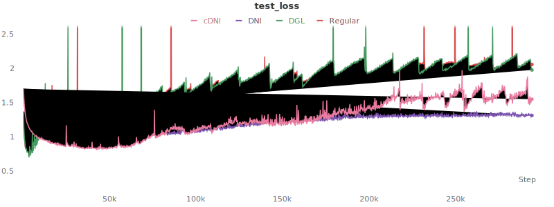
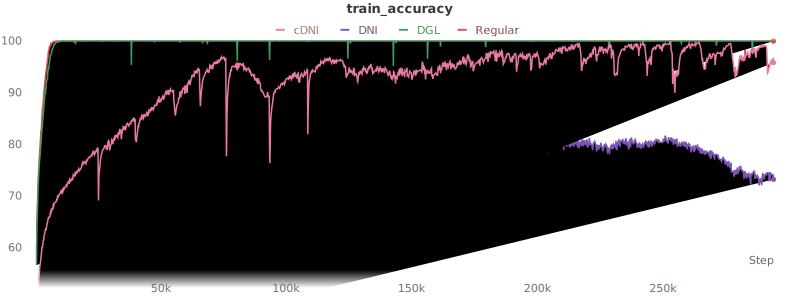
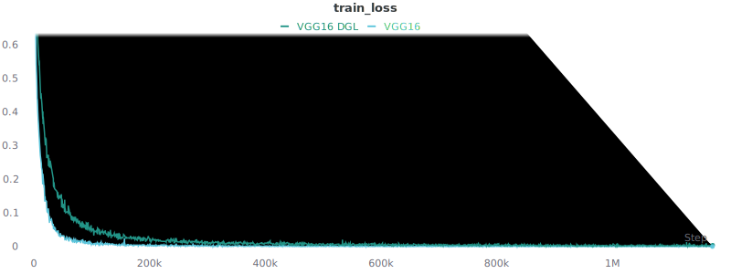

# Table of Contents

- [Table of Contents](#table-of-contents)
- [Introduction](#introduction)
- [Experiments](#experiments)
  - [1st iteration](#1st-iteration)
  - [2nd iteration](#2nd-iteration)
- [Related Work](#related-work)
  - [Representation Learning](#representation-learning)
    - [SimCLR - A Simple Framework for Contrastive Learning of Visual Representations (Feb 2020)](#simclr---a-simple-framework-for-contrastive-learning-of-visual-representations-feb-2020)
    - [SimCLRv2 - Big Self-Supervised Models are Strong Semi-Supervised Learners (Jun 2020)](#simclrv2---big-self-supervised-models-are-strong-semi-supervised-learners-jun-2020)
    - [CPC - Representation Learning with Contrastive Predictive Coding (Jul 2018)](#cpc---representation-learning-with-contrastive-predictive-coding-jul-2018)
    - [CPCv2 - Data-Efficient Image Recognition with Contrastive Predictive Coding (May 2019)](#cpcv2---data-efficient-image-recognition-with-contrastive-predictive-coding-may-2019)
    - [CMC - Contrastive Multiview Coding (Jun 2019)](#cmc---contrastive-multiview-coding-jun-2019)
    - [Context Encoders: Feature Learning by Inpainting (Apr 2016)](#context-encoders-feature-learning-by-inpainting-apr-2016)
    - [Colorful Image Colorization (Mar 2016)](#colorful-image-colorization-mar-2016)
    - [Predicting What You Already Know Helps: Provable Self-Supervised Learning (Aug 2020)](#predicting-what-you-already-know-helps-provable-self-supervised-learning-aug-2020)
    - [Greedy InfoMax - Putting An End to End-to-End: Gradient-Isolated Learning of Representations (May 2019)](#greedy-infomax---putting-an-end-to-end-to-end-gradient-isolated-learning-of-representations-may-2019)
    - [LoCo: Local Contrastive Representation Learning (Aug 2020)](#loco-local-contrastive-representation-learning-aug-2020)
  - [Synthetic Gradients](#synthetic-gradients)
    - [Decoupled Neural Interfaces using Synthetic Gradients (Aug 2016)](#decoupled-neural-interfaces-using-synthetic-gradients-aug-2016)
    - [Understanding Synthetic Gradients and Decoupled Neural Interfaces (Mar 2017)](#understanding-synthetic-gradients-and-decoupled-neural-interfaces-mar-2017)
  - [Layerwise Optimization](#layerwise-optimization)
    - [A Provably Correct Algorithm for Deep Learning that Actually Works (Mar 2018)](#a-provably-correct-algorithm-for-deep-learning-that-actually-works-mar-2018)
    - [Greedy Layerwise Learning Can Scale to ImageNet (Dec 2018)](#greedy-layerwise-learning-can-scale-to-imagenet-dec-2018)
    - [Decoupled Greedy Learning of CNNs (Jan 2019)](#decoupled-greedy-learning-of-cnns-jan-2019)
    - [Parallel Training of Deep Networks with Local Updates (Dec 2020)](#parallel-training-of-deep-networks-with-local-updates-dec-2020)
    - [Training Neural Networks with Local Error Signals (Jan 2019)](#training-neural-networks-with-local-error-signals-jan-2019)
    - [Revisiting Locally Supervised Learning: an Alternative to End-to-end Training (Sep 2020)](#revisiting-locally-supervised-learning-an-alternative-to-end-to-end-training-sep-2020)
  - [Target Propagation](#target-propagation)
    - [Difference Target Propagation (Dec 2014)](#difference-target-propagation-dec-2014)
  - [Miscellaneous](#miscellaneous)
    - [Training Deep Architectures Without End-to-End Backpropagation: A Brief Survey (Jan 2021)](#training-deep-architectures-without-end-to-end-backpropagation-a-brief-survey-jan-2021)
  - [Feedback Alignment](#feedback-alignment)
    - [Random feedback weights support learning in deep neural networks (Nov 2014)](#random-feedback-weights-support-learning-in-deep-neural-networks-nov-2014)
    - [Direct Feedback Alignment Provides Learning in Deep Neural Networks (Sep 2016)](#direct-feedback-alignment-provides-learning-in-deep-neural-networks-sep-2016)
    - [Direct Feedback Alignment Scales to Modern Deep Learning Tasks and Architectures (Jun 2020)](#direct-feedback-alignment-scales-to-modern-deep-learning-tasks-and-architectures-jun-2020)
  - [Books](#books)

# Introduction

Trying to figure out a way to optimize neural-networks differently, that will possibly allow parallelization over the
layers
(inherently impossible in back-propagation).

# Experiments

## 1st iteration

I implemented Decoupled Greedy Learning (took some inspiration from [DGL repo])
I also use [DNI repo] which implemented "Decoupled Neural Interfaces" to incorporate synthetic gradients in my experiments.
I launched training on CIFAR-10 dataset.
The main architecture is (Conv-BatchNorm-ReLU-MaxPool) x 3, followed by a multi-layer-perceptron with 1 hidden layer.
Each conv layer has 128 channels with kernel-size 5 and resolution-preserving padding.
Each affine hidden layer in a multi-layer-perceptron contains 256 channels.
There are 4 variants to the model and training process:
- Regular: The main architecture without changes, as explained previously.
- DGL: Decoupled-Greedy-Learning \
  This model contains an auxiliary network after each block (i.e. Conv-BatchNorm-ReLU-MaxPool).
  Each auxiliary network is a multi-layer-perceptron with 1 hidden layer,
  which predicts the final target (i.e. the classes' scores),
  and it provides the gradient for the relevant block.
  Note that the last "auxiliary network" is actually a part of the final model. \
  The model is implemented in the class `CNNwDGL` in the file `model.py`.
- DNI: Decoupled-Neural-Interface \
  This model contains an auxiliary network after each block (i.e. Conv-BatchNorm-ReLU-MaxPool).
  Each auxiliary network is a CNN containing Conv-BatchNorm-Conv-BatchNorm-Conv
  which preserve the input tensor dimensions (both channels and spatial size).
  The auxiliary network predicts the back-propagated gradient of the downstream layers.
  The model is implemented in the class `CNNwDNI` in the file `model.py`.
- cDNI: Context-Decoupled-Neural-Interface.
  This is the same as DNI except that a "context" (i.e. the label) is provided for each auxiliary network.
  This is done by multiplying the one-hot vector representing the label with a linear layer
  and performs element-wise addition of the result with the output of the first conv layer.

The graphs describing the experiments results are attached.
Ignore the sudden "peaks", it is some sort of numerical issue with my accumulator of the loss and accuracy.

Conclusions:
- Both DGL and the regular model completely overfitted the training-data pretty fast,
  but DNI didn't, and cDNI "almost" did it but not completely. \
  This is probably due to the fact that synthetic gradients don't use the full capacity of the model which causes under-fitting.
- DGL slightly outperformed the regular model with respect to the test accuracy (77.6% v.s. 76.5%). \
  cDNI reached 73.7% (later slightly degraded to 71%-72%). \
  DNI lack behind with 65.6% (later degraded to 58%-60%). \
  My hypothesis is that DGL causes some sort of "regularization" which caused it to outperform
  the regular training, even though they both reached 0 loss.

## 2nd iteration

In the previous iteration, the (best) models reached about 76%-77%, which is below what is normally achieved on the CIFAR-10 dataset. \
In order to increase performance I added data-augmentations:
- Random horizontal flip.
- Random 32x32 crop (after padding with 4 to obtain 40x40 images).
- Data normalization helped a little bit (about 0.5%), 
  but there was no significant difference between normalizing to \[-1,+1\] or to a unit gaussian, 
  so for simplicity \[-1,+1\] was chosen for future experiments.
  
Adding data-augmentations significantly improved performance - from 76%-77% to 85%-86%.
Now there is even less difference between DGL and regular back-prop, and they both reached peak performance of 86.5% test accuracy. \
One notable difference is that DGL's train-loss in decreased slower than regular training, but eventually they both reached (almost) 0 loss.

Next, I implemented the VGG models (VGG11/13/16/19), in order to reproduce the performance in the literature which is above 90%. The model I use for the experiment is VGG16 which consists of the following modules: \
(Conv(64)-BatchNorm-ReLU) x 2 \
MaxPool \
(Conv(128)-BatchNorm-ReLU) x 2 \־
MaxPool \
(Conv(256)-BatchNorm-ReLU) x 3 \
MaxPool \
(Conv(512)-BatchNorm-ReLU) x 3 \
MaxPool \
(Conv(512)-BatchNorm-ReLU) x 3 \
MaxPool \
Linear(10)
- Note that the VGG model was originally built for ImageNet dataset and not for CIFAR-10. \
  For example, it contains 5 down-sampling layers which cause the last convolutional block to reach spatial size of 1x1 whereas in ImageNet it's 7x7. \
  Additionally, the original VGG model contains additional 2 fully-connected layers with 4096 channels 
  which I omitted (as in the CIFAR-10 implementation of VGG I found online).

Comparing VGG16 to our previous BasicCNN shows increased performance (from 86.5% to 93.2%). DGL now performs worse than regular back-prop, achieving 89.5%.

Conclusions:
- DGL extends to other types of architectures like VGG, performing in the same ballpark as regular back-prop but slightly worse.
  -  It is possible that further hyper-parameters search might bridge the gap, as during my (informal) hyper-parameters search I noticed the increasing the learning-rate helped regular back-prop and harmed DGL training.
  - It is possible that different auxiliary networks will increase DGL performance. \
    Currently the auxiliary network used for DGL is one hidden layer MLP with 512 channels. 

# Related Work

## Representation Learning

### SimCLR - A Simple Framework for Contrastive Learning of Visual Representations (Feb 2020)

- Ting Chen, Simon Kornblith, Mohammad Norouzi, Geoffrey Hinton.  
  Google Research, Brain Team.
- Accepted to ICML 2020.
- [paper](https://arxiv.org/pdf/2002.05709.pdf)
- [code](https://github.com/google-research/simclr)

This paper presents SimCLR: A simple framework for contrastive learning of visual representations. \
The self-supervised task is to identify that different augmentations of the same image are the same.

Take home messages:

- Composition of data augmentations is important.
- Adding a nonlinear transformation between the representation and the contrastive loss helps.
- Contrastive learning benefits from larger batch sizes and more training steps compared to supervised learning.

### SimCLRv2 - Big Self-Supervised Models are Strong Semi-Supervised Learners (Jun 2020)

- Ting Chen, Simon Kornblith, Kevin Swersky, Mohammad Norouzi, Geoffrey Hinton.  
  Google Research, Brain Team.
- Accepted to NeurIPS 2020.
- [paper](https://arxiv.org/pdf/2006.10029.pdf)
- [code](https://github.com/google-research/simclr)

This paper presents SimCLRv2: A model based on SimCLR with improvements that reached new state-of-the-art. Generally, the training phase contains three stages: self-supervised pretraining, followed by supervised fine-tuning, and finally distillation with unlabeled examples. Additionally:
- The backbone which learns the representation in a self-supervised way is much larger than original SimCLR - ResNet-152 (3x+SK) v.s. ResNet-50 (4x).
- Later, in the third stage, the model can be made smaller via student-teacher distillation.
- The model uses several "deep-learning tricks" that "make better use of the parameters", such as selective kernels, channel-wise attention mechanism, etc.

Take home messages:
- Notions of task-agnostic v.s. task-specific use of unlabeled data. 
  The first stage (self-supervised pretraining as in original SimCLR) is task-agnostic, 
  whereas the last stage of distillation via unlabeled examples is task-specific.
- The fewer the labels, the more it is possible to benefit from a bigger model.
  

  
  

- Bigger / deeper projection heads improve representation learning.
  

  
  

### CPC - Representation Learning with Contrastive Predictive Coding (Jul 2018)

- Aaron van den Oord, Yazhe Li, Oriol Vinyals.  
  DeepMind, London, UK.
- [paper](https://arxiv.org/pdf/1807.03748.pdf)

Propose a universal unsupervised learning approach to extract useful representations called Contrastive Predictive Coding. Use a probabilistic contrastive
loss which induces the latent space to capture information that is maximally useful to predict future samples. Demonstrate the approach on speech, images, text and RL.

On images (which are not time-series) the model split an image to a grid of overlapping patches, and uses a PixelCNN-style autoregressive model to make predictions about the latent activations in following rows top-to-bottom.

Take home messages:
- They show theoretically that optimizing the InfoNCE loss maximizes a lower bound on the mutual information between the future data-point representation and the context vector (summarizing the past).
- In its time, reached state-of-the-art on unsupervised classification, but this was still quite far from supervised learning.

### CPCv2 - Data-Efficient Image Recognition with Contrastive Predictive Coding (May 2019)

- Olivier J. Henaff. Aravind Srinivas, Jeffrey De Fauw, Ali Razavi, Carl Doersch, S. M. Ali Eslami, Aaron van den Oord.  
  DeepMind, London, UK.  
  University of California, Berkeley.
- [paper](https://arxiv.org/pdf/1905.09272.pdf)

A self-supervised learning approach that builds upon the original CPC with several improvements - model capacity, layer normalization, predicting with context from all directions rather than just from above, path-based augmentations.

They assess CPCv2 in several contexts:
- Linear classification on top of the learned representations.  
  They suprass all self-supervised techniques at that time.
- Transfer learning to object detection in PASCAL dataset.   
  They reach a new state-of-the-art, surpassing supervised transfer-learning.
- Data-efficient learning - learning with less labeled data.  
  They surpass supervised learning with x5-x2 less labeled data, as seen in the graph.  
  

  
  

Take-home messages:
- Self-supervised representations seem to be more "data-efficient", as seen both here and in SimCLRv2.

### CMC - Contrastive Multiview Coding (Jun 2019)

- Yonglong Tian, Dilip Krishnan, Phillip Isola.  
  MIT CSAIL.  
  Google Research.
- [paper](https://arxiv.org/pdf/1906.05849.pdf)
- [code](https://github.com/HobbitLong/CMC/)

Learn a representation in a similar manner as CPC, but instead of maximize mutual information between different patches in an image, it maximizes mutual information between different views of the same image. Note that it scales to any number of views.  

Show empirical results on:
- ImageNet classification when the different views are luminance and chrominance in color images. 
- Video - views are images v.s. optival flow.
- Luminance, chrominance, depth, surface normal and semantic labels on NYU-Depth dataset.

Take-home messages:
- As shown in their experiments, it seems that contrastive loss outperform predictive loss. 
  E.g., it's better to predict that a pair of views is similar rather than predicting one view from the other.
  

  
  

### Context Encoders: Feature Learning by Inpainting (Apr 2016)

- Deepak Pathak, Philipp Krahenbuhl, Jeff Donahue, Trevor Darrell, Alexei A. Efros.  
  University of California, Berkeley.
- Accepted to CVPR 2016.
- [paper](https://arxiv.org/pdf/1604.07379.pdf)
- [code](https://github.com/pathak22/context-encoder)

Present Context-Encoders - a convolutional neural network trained to generate the contents of an arbitrary image region conditioned on its surroundings. In order to succeed at this task, context encoders need to both understand the content of the entire image. Quantitatively demonstrate the effectiveness of the features for CNN pre-training on classification, detection, and segmentation tasks.

Take home messages:
- Similar in spirit to auto-encoders and denoising auto-encoders. \
  However, in auto-encoders the representation is likely to just compress the image content without learning a semantically meaningful representation. \ 
  Denoising auto-encoders is more similar in spirit, but here a large region is missing and not just localized and low-level corruption, 
  so the high level semantics of the image need to be understood.

### Colorful Image Colorization (Mar 2016)

- Richard Zhang, Phillip Isola, Alexei A. Efros.  
  University of California, Berkeley.
- Accepted to ECCV 2016.
- [paper](https://arxiv.org/pdf/1603.08511.pdf)
- [code](https://github.com/richzhang/colorization)

Given a grayscale image predict a plausible color version of the image. \
This colorization can be a powerful pretext task for self-supervised feature learning, acting as a *cross-channel encoder*. Results in state-of-the-art performance on several feature learning benchmarks.

Take home messages:
- Interesting auxiliary task because colorization requires understanding of the semantics of the image.

### Predicting What You Already Know Helps: Provable Self-Supervised Learning (Aug 2020)

- Jason D. Lee, Qi Lei, Nikunj Saunshi, Jiacheng Zhuo.  
  Princeton University.  
  University of Texas at Austin.
- [paper](https://arxiv.org/pdf/2008.01064.pdf)

Propose a mechanism based on conditional independence to formalize how solving certain pretext tasks can learn 
representations that provably decreases the sample complexity of downstream supervised tasks.

### Greedy InfoMax - Putting An End to End-to-End: Gradient-Isolated Learning of Representations (May 2019)

- Sindy Löwe, Peter O`Connor, Bastiaan S. Veeling.  
  AMLab; University of Amsterdam.
- Accepted to NeurIPS 2019 (Honorable Mention Outstanding New Directions Paper Award).
- [paper](https://arxiv.org/pdf/1905.11786.pdf)
- [code](https://github.com/loeweX/Greedy_InfoMax)

Train a neural-network in a self-supervised, local manner (i.e. without labels and without end-to-end backpropagation).

It uses the InfoNCE objective developed in CPC paper ([Representation Learning with Contrastive Predictive Coding]). \
Essentially, this objective pairs the representations of temporally nearby patches and contrasts them against random
pairs. Therefore, as shown in CPC paper, it maximizes the mutual information between temporally nearby representations.

Take home messages:

- Local learning is possible in the regime of self-supervised learning.
- Interesting self-supervised task - maximize the mutual information between temporally nearby representations
  (e.g. different patches of the same image).

### LoCo: Local Contrastive Representation Learning (Aug 2020)

- Yuwen Xiong, Mengye Ren, Raquel Urtasun.  
  Uber ATG.  
  University of Toronto.
- Accepted to NeurIPS 2020.
- [paper](https://arxiv.org/pdf/2008.01342.pdf)

Show that by overlapping local blocks stacking on top of each other, we effectively increase the decoder depth and allow
upper blocks to implicitly send feedbacks to lower blocks.

This simple design closes the performance gap between local learning and end-to-end contrastive learning algorithms for
the first time. Aside from standard ImageNet experiments, also show results on complex downstream tasks such as object
detection and instance segmentation.

Take home messages:

- The overlapping enables "communication" between lower and upper layers.
- Self-supervised local learning can reach the performance of supervised back-propagation learning.

## Synthetic Gradients

### Decoupled Neural Interfaces using Synthetic Gradients (Aug 2016)

- Max Jaderberg, Wojciech Marian Czarnecki, Simon Osindero, Oriol Vinyals, Alex Graves, David Silver, Koray Kavukcuoglu.  
  DeepMind, London, UK.
- Accepted to ICML 2017.
- [paper](https://arxiv.org/pdf/1608.05343.pdf)
- [code](https://github.com/koz4k/dni-pytorch)

Use auxiliary networks to decouple sub-graphs, enabling updating them independently and asynchronously.

In particular focus on using the modelled synthetic gradient in place of true back-propagated error gradients.

Predicting the inputs to downstream layers is also possible, completely unlocking (i.e. forward-unlocking) the training.

Take home messages:

- Notions of backward-locking, update-locking and forward-locking. \
  All of them are possible (to some extent).
- It works, but (quite) worse than regular back-propagation.

### Understanding Synthetic Gradients and Decoupled Neural Interfaces (Mar 2017)

- Wojciech Marian Czarnecki, Grzegorz Swirszcz, Max Jaderberg, Simon Osindero, Oriol Vinyals,
Koray Kavukcuoglu.  
  DeepMind, London, UK.
- Accepted to ICML 2017.
- [paper](https://arxiv.org/pdf/1703.00522.pdf)

Provide some theoretical explanations to synthetic gradients, for example:

- The critical points of the original optimization problem are maintained when using synthetic-gradients.
- Analyze the learning dynamics of synthetic gradients.

## Layerwise Optimization

### A Provably Correct Algorithm for Deep Learning that Actually Works (Mar 2018)

- Eran Malach, Shai Shalev-Shwartz.  
  The Hebrew University, Israel.
- [paper](https://arxiv.org/pdf/1803.09522.pdf)

Create a toy dataset containing digits that are generated hierarchically, and prove layerwise optimization works.

### Greedy Layerwise Learning Can Scale to ImageNet (Dec 2018)

- Eugene Belilovsky, Michael Eickenberg, Edouard Oyallon.  
  Mila, University of Montreal.  
  University of California, Berkeley.  
  CentraleSupelec, University of Paris-Saclay.
- Accepted to ICML 2019.
- [paper](https://arxiv.org/pdf/1812.11446.pdf)

Show that greedy layerwise optimization can reach competitive performance on ImageNet.

Take home messages:
- local optimization works.
- layerwise training increases linear separability of the different layers' activations.
- Using auxiliary network with more than 1 hidden layer works better.

### Decoupled Greedy Learning of CNNs (Jan 2019)

- Eugene Belilovsky, Michael Eickenberg, Edouard Oyallon.  
  Mila, University of Montreal.  
  University of California, Berkeley.  
  CentraleSupelec, University of Paris-Saclay.
- Accepted to ICML 2020.
- [paper](https://arxiv.org/pdf/1901.08164.pdf)
- [code](https://github.com/eugenium/DGL)

Show that the greedy layerwise model can be trained in parallel, 
with the possibility of adding a buffer between two adjacent layers to completely unlocking the training process.

### Parallel Training of Deep Networks with Local Updates (Dec 2020)

- Michael Laskin, Luke Metz, Seth Nabarro, Mark Saroufim, Badreddine Noune, Carlo Luschi, Jascha Sohl-Dickstein, Pieter Abbeel.  
  University of Berkeley.  
  Google Research, Brain Team.  
  Graphcore.
- [paper](https://arxiv.org/pdf/2012.03837.pdf)

Provide the first large scale investigation into local update methods in both vision and language domains.

Take home messages:
- Same as LoCo (which was done in the self-supervised setting),
  overlapping of layers seems to help also in the supervised local learning framework.
- Gradients of earlier layers differ from the true gradients (of regular back-prop).
  

  
  

- Global back-propagation demonstrates higher capacity, in that it is able to memorize the dataset
  better than local greedy backpropagation.
  

  
  

- Local methods learn different features (e.g. the first conv filters "look" different).
  

  
  

### Training Neural Networks with Local Error Signals (Jan 2019)

- Arild Nøkland, Lars H. Eidnes.  
  Kongsberg Seatex, Trondheim, Norway.
- Accepted to ICML 2019.
- [paper](https://arxiv.org/pdf/1901.06656.pdf)
- [code](https://github.com/anokland/local-loss)

Use single-layer auxiliary-networks and two different supervised loss functions to generate local error signals, 
and show that the combination of these losses helps.

In addition to predicting the target classes' scores, they add another a 'similiarity loss' which encourages distinct classes to have distinct representations.
They perform experiments using VGG-like networks on a lot of datasets, approaching and sometime surpassing the performance of regular back-prop. For example, in CIFAR-10 reached 95%-96% test accuracy.

Take home messages:
- Similiary loss works quite good, and somehow complementary to regular prediction loss (indeed, using combination of these losses helps).

### Revisiting Locally Supervised Learning: an Alternative to End-to-end Training (Sep 2020)

- Yulin Wang, Zanlin Ni, Shiji Song, Le Yang & Gao Huang.  
  Department of Automation, BNRist, Tsinghua University, Beijing, China.
- Accepted to ICLR 2021.
- [paper](https://arxiv.org/pdf/2101.10832.pdf)
- [code](https://github.com/blackfeather-wang/InfoPro-Pytorch)

Experimentally show that simply training local modules with E2E loss tends to collapse task-relevant information at early layers, and hence hurts the performance of the full model.  
To avoid this issue, propose an information propagation (InfoPro) loss, which encourages local modules to preserve as much useful information as possible, while progressively discard task-irrelevant information. The proposed method boils down to minimizing the combination of a reconstruction loss and a normal cross-entropy/contrastive term.

The intuitive idea is presented in the following figure:

and these graphs show that greedy SL contributes to dramatically more discriminative features with the first few local modules, whereas E2E learned network progressively boosts the linear separability of features throughout the whole network with even more significant effects in the later layers, surpassing greedy SL eventually.  

This raises an interesting question: *why does the full network achieve inferior performance in greedy SL compared to the E2E counterpart, even though the former is based on more discriminative earlier features*?  

The conjecture is that the answer to the above question might lie in the differences of features
apart from merely separability - in E2E learned networks, I(h, y) remains unchanged when the features pass through all the layers, while I(h, x) reduces gradually, revealing that the models progressively discard task-irrelevant information. However, greedily trained networks collapse both I(h, x) and I(h, y) in their first few modules. 

The InfoPro loss is defined as:

where r* capture as much task-irrelevant information in h as possible.   
Upper for the intractable InfoPro loss is:

estimating I(h,x) by training a decoder to obtain the minimal reconstruction loss, and estimating I(h,y) by a regular classification fashion (with the cross-entropy loss) or by using contrastive representation loss (making representations of same-class similar and different-class different)..

## Target Propagation

### Difference Target Propagation (Dec 2014)

- Dong-Hyun Lee, Saizheng Zhang, Asja Fischer, Yoshua Bengio.  
  Universite de Montreal, Quebec, Canada.
- [paper](https://arxiv.org/pdf/1412.7525.pdf)

Associate with each feedforward unit’s activation value a **target value** rather than a **loss gradient**. 
The target value is meant to be close to the activation value while being likely to have provided a smaller loss 
(if that value had been obtained in the feedforward phase). 
Suppose the network structure is defined by 

where h_i is the state of the i-th hidden layer (h_M is the output and h_0 is the input). 
Define 

The set of parameters defining the mapping between the i-th and the j-th layer. 
We can now write h_j as a function of h_i by

The loss depends on the state of the i-th layer as follows:

The basic idea of target-propagation is to assign to each h_i a nearby value \hat{h_i} which (hopefully) leads to a lower global loss:

Such a \hat{h_i} is called a **target** for the i-th layer. Now update the weights of the i-th layer to minimize the MSE loss

Now, the top layer target should be directly driven from the gradient of the global loss (e.g. \hat{h_M} = y). 
For earlier layers take advantage of an "approximate inverse". Suppose for each f_i we have a function g_i such that 

Then choosing 

would have the consequence that (under some smoothness assumptions on f and g) minimizing the distance between h_{i−1} and \hat{h_{i-1}} should also minimize the loss L_i of the i-th layer. 
Obtaining such an inverse function is done using auto-encoder. 
This idea is illustrated here

This paper shows that a linear correction for the imperfectness of the auto-encoders, called **difference** target propagation, is very effective to make target propagation actually work. It basically defines a different target 

which helps (read the paper for full details).

Take home messages:
- Interesting idea. 
- Unfortunately, seems to work worse than the alternatives (proxy objectives and synthetic gradients). \
  Furthermore, experiments were done using only fully-connected networks (MNIST and CIFAR-10).

## Miscellaneous

### Training Deep Architectures Without End-to-End Backpropagation: A Brief Survey (Jan 2021)

- Shiyu Duan, Jose C. Prıncipe.  
  University of Florida.
- [paper](https://arxiv.org/pdf/2101.03419.pdf)

A nice survey of alternatives to back-propagation. It covers three main topics:
- Proxy Objectives - Use some local objective for each layer. \
  Covers:
  - Two papers of the survey authors - encourage representations of same-class samples to be closer and different-class samples to be distinct.
  - Belilovsky et al. (2019;2020).
  - Nøkland et al. (2019) - basically a combination of Belilovsky et al. and the survey authors' papers.
  - Two papers which resemble DGL but differ in their auxiliary networks - one uses a fixed random weighted fully-connected layer, and the other uses trainable two layered fully-connected network.
- Target Propagation - Use specific target tensor for each layer. \
  Covers:
  - "Difference target propagation" and "How auto-encoders could provide credit assignment in deep networks via target propagation".
  - "A theoretical framework for target propagation".
- Synthetic Gradients \
  Covers the original paper and the following paper giving some theoretical insights.

Take home messages:
- Trying to make the representations of same-class samples to be close and different-class samples to be far 
  seems like an interesting and somewhat "popular" idea. 
  Both the authors and Nøkland et al. (2019) found it works, but there are no good explanations. \
  It requires "less labels" - only same/not-same class, and not the actual class.
- The authors papers seem to have interesting theoretical claims - worth a read.
- Target propagation seems interesting and worth a read. However it seems to work worse than proxy objectives. \
  The new paper from 2020 shows "Direct TP" which is similar in spirit to "Direct FA".

## Feedback Alignment

### Random feedback weights support learning in deep neural networks (Nov 2014)

- Timothy P. Lillicrap, Daniel Cownden, Douglas B. Tweed, Colin J. Akerman.  
  University of Oxford.  
  Stockholm University.  
  University of Toronto.  
  York University, Toronto.
- Accepted to Nature Communications 2016 ([pdf](https://www.nature.com/articles/ncomms13276.pdf)).
- [arXiv paper](https://arxiv.org/pdf/1411.0247.pdf)

Instead of multiplying the back-propagated gradients with the forward weight matrix transposed,
multiply by a random matrix. The motivation is to obtain a more biological plausible learning rule.

Take home messages:
- The network "learns to learn".
- The angle between the directions of feedback alignment and back-prop decreases to below 90 degrees,
  meaning the direction of progress is still "descending". \
  Interestingly, the angle between the pseudo-inverse of the forward weight matrix goes to zero.
  
  

  
  

  Note that there is also the "Nature communications" version: [Random synaptic feedback weights support error backpropagation for deep learning]

### Direct Feedback Alignment Provides Learning in Deep Neural Networks (Sep 2016)

- Arild Nøkland.  
  Trondheim, Norway.
- Accepted to NIPS 2016.
- [paper](https://arxiv.org/pdf/1609.01596.pdf)

Instead of using a random matrix to multiply with the back-propagated gradient,
use a random matrix for multiplying the top error directly (without backward passing through the top layers).
This enables backward-unlocking of the training process.

Take home messages:
- Learning is possible even when the feedback path is disconnected from the forward path.
- Performed experiments on small datasets such as MNIST and CIFAR. \
  Works okay, slightly worse performance than back-prop.

### Direct Feedback Alignment Scales to Modern Deep Learning Tasks and Architectures (Jun 2020)

- Julien Launay, Iacopo Poli, François Boniface, Florent Krzakala.  
  LightOn.  
  LPENS, École Normale Supérieure.  
  IdePhics, EPFL.
- Accepted to NeurIPS 2020.
- [paper](https://arxiv.org/pdf/2006.12878.pdf)
- [code](https://github.com/lightonai/dfa-scales-to-modern-deep-learning)

Showed empirically that direct feedback alignment works on a variety of different and difficult tasks,
such as neural view synthesis (e.g. NeRF), click-through rate prediction with recommender systems,
geometric learning with graph-convolutional networks and NLP with transformers.

Take home messages:
- Seems to work okay but not as good as back-prop.

## Books

- [Convex Optimization](https://web.stanford.edu/~boyd/cvxbook/bv_cvxbook.pdf)
- [Online Learning and Online Convex Optimization](https://www.cs.huji.ac.il/~shais/papers/OLsurvey.pdf)
